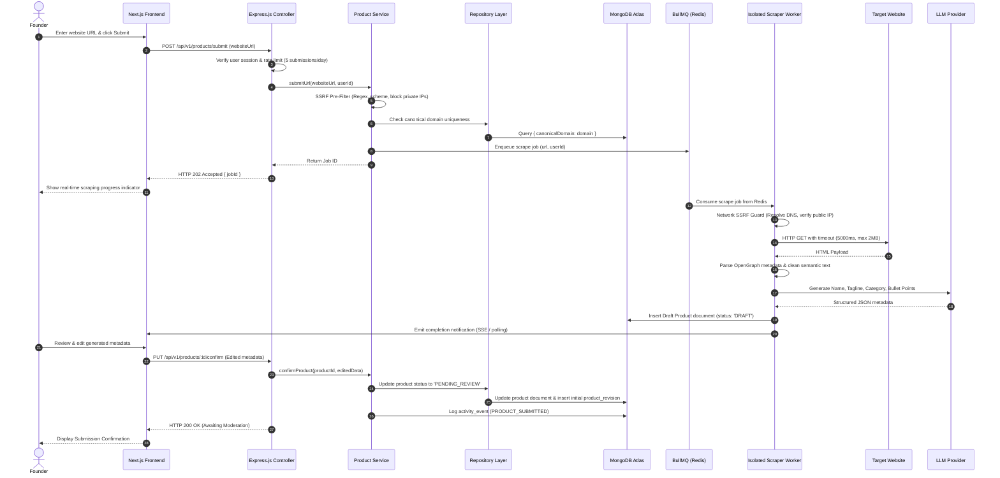
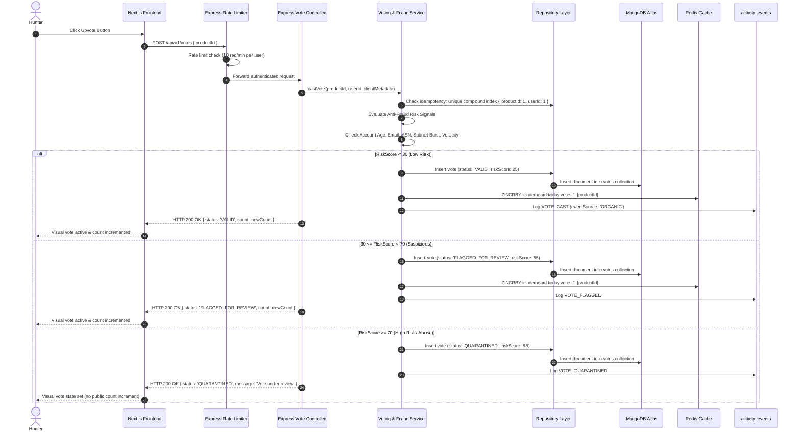
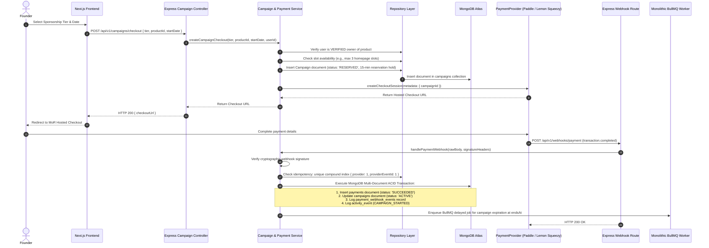
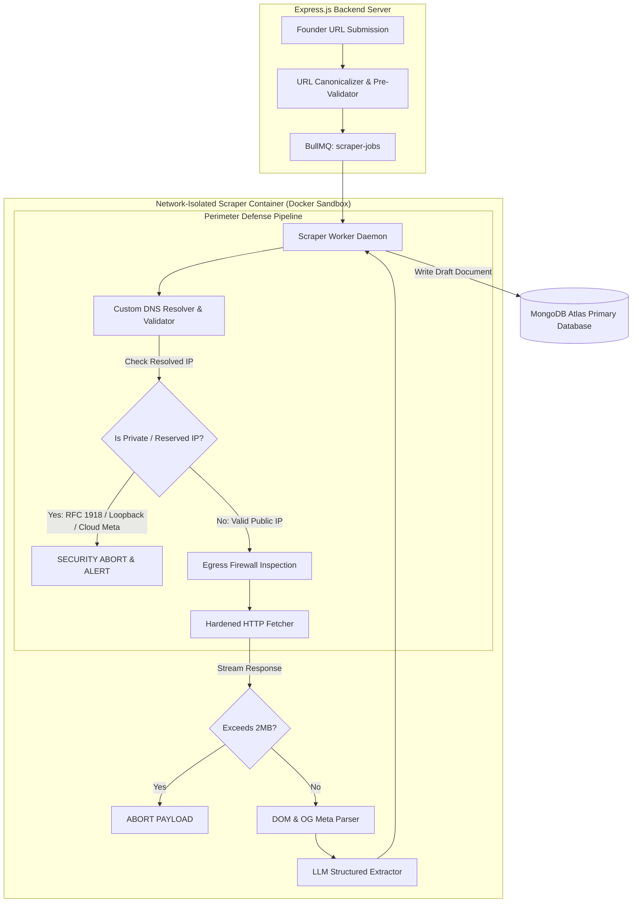
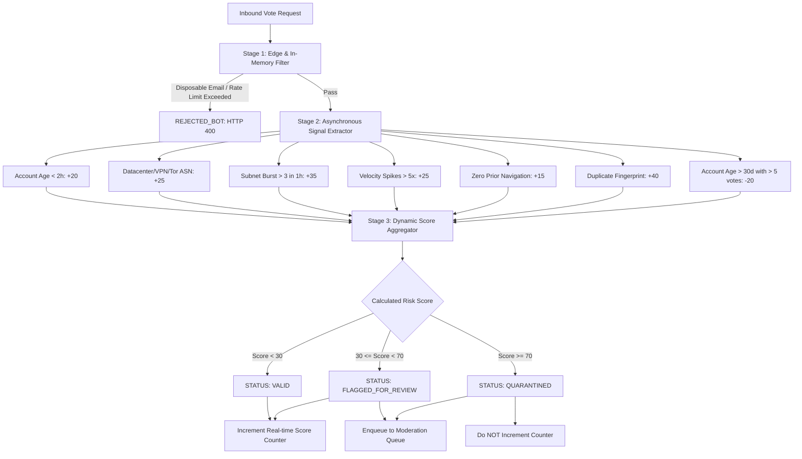

# LaunchProduct — System Architecture

**Document Version:** 1.4.0  
**Status:** Engineering Ready  
**Source Requirement:** PRD v1.3.0 & UI-UX.md v1.0.0  
**Last Updated:** September 21, 2026  
**Architecture Pattern:** Layered Monolith  
**Frontend:** Next.js 14+ (App Router, Poppins primary typeface, UI-UX.md design tokens, Server Components for SEO, Client Components for Interactivity)  
**Backend:** Express.js 4/5 (REST API, Node.js 20 LTS, TypeScript)  
**Primary Database:** MongoDB Atlas (Managed Dedicated Cluster, M10+ Multi-AZ Replica Set)  
**Application Database:** MongoDB 7+  
**Cache / Supporting Infrastructure:** Redis 7 (Sorted Sets, Rate Limiting, BullMQ)  
**Background Processing:** Background Worker(s) within the monolithic application architecture (BullMQ)  
**Scraper:** Dedicated Network-Isolated Scraper Worker Process  
**Monetization / Payments:** Global Merchant of Record (Paddle / Alternative: Lemon Squeezy)  
**Target Environment:** Node.js 20 LTS / Next.js / Express.js / MongoDB Atlas / Redis 7 / Docker  

---

## 1. Architecture Overview

### 1.1 Architectural Pattern & Philosophy: Layered Monolith
LaunchProduct is architected as a **Layered Monolith** with a decoupled Next.js frontend, an Express.js backend API, and an isolated asynchronous scraper worker. This topology maximizes developer velocity, enforces clear separation of concerns, guarantees strict compile-time and runtime boundary isolation, and avoids distributed microservice complexity for the MVP.

The architectural principles governing LaunchProduct are:
1. **Frontend**: Built on **Next.js** strictly as the presentation and client interaction layer. Next.js handles server-side rendering (SSR), incremental static regeneration (ISR) for public directory SEO, and dynamic client components. **Next.js API Routes are NOT used as the backend.**
2. **Backend API**: Built on **Express.js** strictly as the authoritative backend server. Express.js exposes standardized RESTful endpoints under `/api/v1/*`, manages HTTP middleware (CORS, Helmet, Rate Limiting, Session Auth), validates inputs with Zod, and delegates all execution to a distinct Service Layer.
3. **Layered Monolith Design**: The Express.js backend strictly separates responsibilities into horizontal layers:
   - **Controller Layer**: Express route handlers managing HTTP requests, headers, and responses.
   - **Service Layer**: Pure business logic, state machines, anti-fraud evaluations, ranking formulas, and domain events.
   - **Repository Layer**: Data access abstractions interfacing with MongoDB Atlas via Mongoose models.
   - **Worker / Jobs Layer**: Background job processors executing within the monolithic backend architecture.
4. **Primary Database**: **MongoDB Atlas** is the FINAL and CONFIRMED system of record for all persistent application data.
5. **Cache / Supporting Infrastructure**: **Redis 7** provides high-speed ephemeral caching, sliding-window rate limiting, and BullMQ queue coordination. **Redis is NOT the source of truth.**
6. **Isolated Scraper Worker**: A dedicated, network-isolated Node.js worker container with host-level egress firewall rules to safely process untrusted external URLs without exposing internal services.
7. **Global Merchant of Record (MoR)**: Provider-agnostic payment processing (Paddle / Lemon Squeezy) with server-side webhook verification.

#### High-Level Target Architecture
```text
                    ┌──────────────────────┐
                    │      Next.js         │
                    │      Frontend        │
                    └──────────┬───────────┘
                               │
                         HTTP / HTTPS
                               │
                               ▼
                    ┌──────────────────────┐
                    │      Express.js      │
                    │      Backend API     │
                    └──────────┬───────────┘
                               │
              ┌────────────────┼────────────────┐
              │                │                │
              ▼                ▼                ▼
        ┌───────────┐    ┌───────────┐   ┌────────────┐
        │  Service  │    │ Repository│   │   Worker   │
        │   Layer   │    │   Layer   │   │ / Jobs     │
        └─────┬─────┘    └─────┬─────┘   └─────┬──────┘
              │                │                │
              └────────────────┼────────────────┘
                               ▼
                    ┌──────────────────────┐
                    │    MongoDB Atlas     │
                    │   Primary Database   │
                    └──────────────────────┘

                    ┌──────────────────────┐
                    │        Redis         │
                    │ Cache / Rate Limit / │
                    │ Short-lived State    │
                    └──────────────────────┘

                    ┌──────────────────────┐
                    │  Isolated Scraper    │
                    │      Worker          │
                    └──────────────────────┘

                    ┌──────────────────────┐
                    │ Global Payment MoR   │
                    │ Paddle / Alternative │
                    └──────────────────────┘
```

### 1.2 System Architecture Diagram

```mermaid
graph TD
    Client[User Browser / Mobile Client] -->|HTTPS / TLS 1.3| Edge[CDN / Cloudflare Edge Layer]
    Edge -->|Rendered Pages / SSR / ISR / Static| NextApp[Next.js 14+ Frontend Server :3000]
    Edge -->|Direct API / Webhooks / Outbound Clicks| ExpressApp[Express.js Backend API Server :4000]
    NextApp -->|HTTP / HTTPS REST Calls /api/v1/*| ExpressApp

    subgraph "Express.js Backend (Layered Monolith)"
        ExpressApp --> RoutingMiddleware[Express Router & Middleware Layer]
        RoutingMiddleware -->|Auth, CORS, Helmet, Zod Validation| Controllers[Controller Layer]
        
        Controllers --> ServiceLayer[Domain Service Layer]
        ServiceLayer --> ProductService[Product Service]
        ServiceLayer --> SearchService[Search Service]
        ServiceLayer --> VotingService[Voting Service]
        ServiceLayer --> AntiFraudService[Anti-Fraud Risk Engine]
        ServiceLayer --> RankingService[Ranking Engine]
        ServiceLayer --> CampaignService[Campaign & Inventory Service]
        ServiceLayer --> PaymentService[Payment Provider Service]
        ServiceLayer --> AnalyticsService[Analytics & Redirector]
        ServiceLayer --> OwnershipService[Ownership Verification Service]
        ServiceLayer --> ModerationService[Moderation Desk Service]

        ServiceLayer --> RepositoryLayer[Repository Data Access Layer]
        RepositoryLayer --> MongoDBStore[(MongoDB Atlas M10+ Primary Database)]

        subgraph "Monolithic Worker & Jobs Subsystem"
            ServiceLayer -->|Enqueue Jobs| BullMQQueue[BullMQ Redis Queues]
            BullMQQueue --> MonolithicWorkers[Monolithic Background Workers]
            MonolithicWorkers --> RankingWorker[Leaderboard Snapshot Worker]
            MonolithicWorkers --> CampaignWorker[Campaign Expiry Worker]
            MonolithicWorkers --> AnalyticsWorker[Event Ledger Processor]
            MonolithicWorkers --> RepositoryLayer
        end
    end

    subgraph "Supporting Infrastructure"
        ExpressApp <-->|Leaderboard ZSET / Rate Limits| RedisStore[(Redis 7 Ephemeral Store)]
        MonolithicWorkers <--> RedisStore
    end

    subgraph "Network-Isolated Scraper Process"
        BullMQQueue -->|Scrape Tasks| ScraperWorker[Isolated Scraper Worker Container]
        ScraperWorker -->|Egress Firewall / DNS Check| TargetWebsites[Target Product Websites]
        ScraperWorker -->|Structured Completion| LLMProvider[LLM Provider / OpenAI / Anthropic]
        ScraperWorker -->|Write Draft Document| RepositoryLayer
    end

    subgraph "External Integrations"
        Controllers -->|OAuth 2.0 Callbacks| GoogleOAuth[Google / GitHub OAuth]
        ServiceLayer -->|Transactional Mail| ResendSES[Email Provider / Resend / SES]
        Controllers -->|Server-to-Server Webhooks| MoRProvider[Global MoR: Paddle / Lemon Squeezy]
        AntiFraudService -->|Local ASN Lookup| MaxMindDB[(Local MaxMind GeoIP/ASN DB)]
    end
```



### 1.3 Synchronous vs. Asynchronous Request Paths

| Operation | Path Type | Processing Strategy | SLA / Latency Target |
| :--- | :--- | :--- | :--- |
| **Directory Navigation / Search** | Synchronous | Next.js Server Components call Express.js `/api/v1/products` via HTTP; Express queries MongoDB Atlas compound text indexes + Redis cache | $\le 150$ms (p95) `[ENGINEERING VALIDATION REQUIRED]` |
| **Outbound Click Redirect** | Synchronous + Async | Express.js `/api/v1/clicks/:id` issues immediate HTTP 302; enqueues click event to Redis BullMQ asynchronously | $\le 25$ms redirect latency |
| **Upvoting & Edge Fraud Check**| Hybrid | Express.js `/api/v1/votes` executes synchronous rate-limit & fast checks; async detailed signal evaluation and event logging | $\le 80$ms client response |
| **URL Submission Scraping** | Asynchronous | Express.js enqueues job to Redis BullMQ; client polls or receives server-sent notification | 3,000ms – 8,000ms total job duration |
| **MoR Webhook Processing** | Synchronous + Async | Express.js `/api/v1/webhooks/payment` verifies signature synchronously (HTTP 200); slot activation executed in MongoDB transaction | $\le 200$ms webhook response |
| **Daily Leaderboard Freeze** | Asynchronous | Scheduled BullMQ cron worker in Express monolithic worker layer at `23:59:59 UTC`; writes immutable snapshots to MongoDB Atlas | $\le 30$ seconds execution window |

---

## 2. Technology Stack & Component Responsibilities

| Layer | Technology | Responsibility | Non-Responsibilities / Boundaries |
| :--- | :--- | :--- | :--- |
| **Frontend** | **Next.js 14+** | Presentation layer, React Server Components (RSC) for public directory SEO, Client Components for interactivity, Tailwind / Vanilla CSS. Communicates with Express.js API via HTTP/HTTPS. | Must NOT connect directly to MongoDB Atlas. Must NOT run backend business logic or API route handlers as the backend. |
| **Backend API** | **Express.js 4/5 (Node.js 20 LTS)** | Authoritative REST API server (`/api/v1/*`), routing, HTTP middleware (cors, helmet, rate-limit), Zod input validation, session cookie verification. | Must NOT embed heavy scraping tasks directly into the HTTP event loop. |
| **Service Layer** | **Pure Domain Services (TypeScript)** | Business logic enforcement, ranking calculations, 6-factor fraud scoring, campaign state machines, and domain event emission. | Agnostic of HTTP transport details (no raw `req`/`res` manipulation). |
| **Repository Layer** | **Mongoose 8+ / MongoDB Native Driver** | Data access abstraction, MongoDB Atlas queries, JSON Schema validation, compound/unique/TTL indexes, and multi-document transactions. | Agnostic of business workflows; strictly manages persistence and query optimization. |
| **Primary Database**| **MongoDB Atlas (MongoDB 7+)** | Authoritative system of record for all application state: users, products, votes, revisions, campaigns, snapshots, and event logs. Managed dedicated M10+ multi-AZ replica set with continuous backup and PITR. | Must NOT be used as a high-frequency ephemeral cache for sub-second sliding-window counters. |
| **Cache & In-Memory** | **Redis 7** | Real-time leaderboard score caching (Sorted Sets), distributed sliding-window rate-limiting, temporary slot holds, BullMQ queue streams. | Must NOT be treated as permanent durable storage without MongoDB Atlas persistence. |
| **Background Processing** | **BullMQ 5.x (Monolithic Workers)** | Distributed asynchronous job execution within the monolithic backend: leaderboard freeze cron, campaign expiration checks, batch event flushing, email delivery. | Must NOT handle synchronous critical-path HTTP client read requests. |
| **Isolated Scraper** | **Headless Fetcher / Playwright (Worker Process)** | Controlled external HTTP fetch, DOM parsing, OpenGraph extraction, metadata payload generation inside a sandboxed container. | Must NOT have access to internal application network interfaces or database write credentials directly. |
| **Payments** | **Global Merchant of Record (Paddle / Lemon Squeezy)** | Tax compliance, international checkout, credit card processing, webhook event delivery via `PaymentProvider` abstraction. | Does NOT directly alter product states without verified server-side webhook processing. |

---

## 3. Application Architecture & Layered Monolith Structure

### 3.1 Monorepo Directory Layout

The codebase implements a clean **Layered Monolith** architecture with strict separation between the Next.js frontend, the Express.js backend, and the isolated scraper container:

```text
launchproduct/
├── frontend/                          # Next.js 14+ Presentation Layer (:3000)
│   ├── src/
│   │   ├── app/                       # Next.js App Router (Public, Auth, Dashboard, Admin)
│   │   │   ├── (public)/              # Public directory, category browse, PDP, leaderboard
│   │   │   ├── (auth)/                # Magic link request, OAuth callback handlers
│   │   │   ├── (dashboard)/           # Founder dashboard, analytics, product management
│   │   │   └── (admin)/               # Moderation desk, review queues, inventory manager
│   │   ├── components/                # Reusable UI components (Modals, Cards, Tables, Nav)
│   │   ├── lib/
│   │   │   ├── api-client.ts          # Axios / Fetch client targeting Express Backend API
│   │   │   └── auth-client.ts         # Client session helpers
│   │   └── styles/                    # Global styles and design system tokens
│   ├── public/                        # Static assets, logos, favicon
│   ├── package.json
│   └── next.config.js
│
├── backend/                           # Express.js Layered Monolith Server (:4000)
│   ├── src/
│   │   ├── controllers/               # Express Request/Response Controllers
│   │   │   ├── auth.controller.ts
│   │   │   ├── product.controller.ts
│   │   │   ├── vote.controller.ts
│   │   │   ├── campaign.controller.ts
│   │   │   ├── payment.controller.ts
│   │   │   ├── analytics.controller.ts
│   │   │   ├── ownership.controller.ts
│   │   │   └── moderation.controller.ts
│   │   ├── routes/                    # Express Router Definitions (/api/v1/*)
│   │   │   ├── index.ts               # Root API router aggregator
│   │   │   ├── auth.routes.ts
│   │   │   ├── product.routes.ts
│   │   │   ├── vote.routes.ts
│   │   │   ├── campaign.routes.ts
│   │   │   ├── payment.routes.ts
│   │   │   ├── analytics.routes.ts
│   │   │   ├── ownership.routes.ts
│   │   │   └── webhook.routes.ts      # Raw body parser for MoR webhooks
│   │   ├── middleware/                # Express Middleware Pipeline
│   │   │   ├── auth.middleware.ts     # JWT / Session cookie verification & RBAC guard
│   │   │   ├── validate.middleware.ts # Zod schema validation middleware
│   │   │   ├── rate-limit.middleware.ts# Redis-backed sliding window rate limiter
│   │   │   ├── security.middleware.ts # Helmet, CORS, mongo-sanitize
│   │   │   └── error.middleware.ts    # Global RFC 7807 problem details handler
│   │   ├── services/                  # Pure Domain Service Layer (Business Logic)
│   │   │   ├── auth.service.ts
│   │   │   ├── product.service.ts
│   │   │   ├── voting.service.ts
│   │   │   ├── fraud.service.ts       # 6-signal anti-fraud engine
│   │   │   ├── ranking.service.ts     # 4 ranking formulas & snapshot logic
│   │   │   ├── campaign.service.ts    # Inventory reservation & tier rules
│   │   │   ├── payment.service.ts     # PaymentProvider abstraction implementation
│   │   │   ├── analytics.service.ts   # Salted HMAC session attribution & clickstream
│   │   │   ├── ownership.service.ts   # 3-way ownership verification engine
│   │   │   └── moderation.service.ts  # Moderation triage & audit trail
│   │   ├── repositories/              # Repository Layer (MongoDB Atlas Data Access)
│   │   │   ├── user.repository.ts
│   │   │   ├── product.repository.ts
│   │   │   ├── vote.repository.ts
│   │   │   ├── review.repository.ts
│   │   │   ├── campaign.repository.ts
│   │   │   ├── payment.repository.ts
│   │   │   ├── snapshot.repository.ts
│   │   │   └── event.repository.ts
│   │   ├── models/                    # Mongoose Schemas, Indexes & Validation Rules
│   │   │   ├── User.model.ts
│   │   │   ├── Product.model.ts
│   │   │   ├── Category.model.ts
│   │   │   ├── Vote.model.ts
│   │   │   ├── Campaign.model.ts
│   │   │   ├── Payment.model.ts
│   │   │   ├── Snapshot.model.ts
│   │   │   └── ActivityEvent.model.ts
│   │   ├── workers/                   # Monolithic Background Workers (BullMQ)
│   │   │   ├── ranking.worker.ts      # Daily UTC freeze cron worker
│   │   │   ├── campaign.worker.ts     # Campaign expiry & slot release worker
│   │   │   ├── events.worker.ts       # Batch activity_events flusher
│   │   │   └── email.worker.ts        # Outbound transactional email dispatcher
│   │   ├── shared/                    # Shared Utilities & Clients
│   │   │   ├── db.ts                  # MongoDB Atlas Mongoose connection manager
│   │   │   ├── redis.ts               # Redis client connection manager
│   │   │   ├── logger.ts              # Pino structured JSON logger
│   │   │   ├── errors.ts              # Domain exception hierarchy
│   │   │   └── constants.ts           # System settings, fraud weights, score formulas
│   │   ├── server.ts                  # Express HTTP server bootstrap
│   │   └── package.json
│   │
├── scraper/                           # Network-Isolated Scraper Container
│   ├── src/
│   │   ├── index.ts                   # Scraper worker process consuming BullMQ
│   │   ├── fetcher.ts                 # DNS pre-resolving SSRF-safe HTTP fetcher
│   │   ├── parser.ts                  # OpenGraph & semantic HTML extractor
│   │   └── llm.ts                     # AI structured metadata generator
│   ├── Dockerfile                     # Zero-internal-VPC network isolation image
│   └── package.json
│
├── docker/                            # Production Docker configurations
├── docker-compose.yml                 # Local dev: Next.js + Express.js + Scraper + Redis
├── package.json                       # Monorepo root package.json
└── tsconfig.json

```

### 3.2 Layered Architecture Execution Flow

Within the Express.js backend, data and control flow strictly downward through explicit interfaces:

```text
Next.js Frontend (Browser / Server Components)
                 │
           HTTP / HTTPS REST (/api/v1/*)
                 │
                 ▼
Express.js Controller Layer (req/res mapping, Zod validation, Auth session check)
                 │
                 ▼
Domain Service Layer (Business rules, state machine, anti-fraud math, ranking)
                 │
                 ├──► Event Ledger Emitter (activity_events)
                 ├──► Enqueue Background Jobs (BullMQ Redis)
                 │
                 ▼
Repository Layer (MongoDB Atlas queries, Mongoose models, ACID transactions)
                 │
                 ▼
MongoDB Atlas (Primary Database)   &   Redis (Ephemeral Cache / Rate Limits)
```
---

## 4. Request Flow Architecture

### Flow A: User Authentication (Magic Link)
1. **Entry Point**: Next.js client submits email to Express.js Backend API: `POST /api/v1/auth/magic-link`.
2. **Validation & Rate Limit**: Express rate-limit middleware checks IP/subnet quota (5 req/hour); Zod validates email against disposable email blacklist.
3. **Token Generation**: Domain service generates a 32-byte cryptographically secure random token; hashes token using SHA-256 for MongoDB Atlas storage in `verification_tokens` (15-min expiry via TTL index).
4. **Email Delivery**: Express backend enqueues job to BullMQ; monolithic worker dispatches email via Resend/SES containing magic link `https://launchproduct.io/auth/verify?token=...`.
5. **Callback Verification**: User clicks link in browser $\to$ Next.js frontend calls Express.js `GET /api/v1/auth/verify?token=...`. Token is hashed and verified against MongoDB Atlas using `crypto.timingSafeEqual()`.
6. **Session Creation**: On match, token document is deleted atomically; Express issues an encrypted, HttpOnly, `SameSite=Lax` session cookie. Emits `activity_event` (`AUTH_MAGIC_LINK_REQUESTED`).

### Flow B & C: Product Submission & Secure Scraper Pipeline


### Flow D: Ownership Verification
1. **Entry**: Next.js frontend calls Express.js: `POST /api/v1/products/:id/claim`.
2. **Auth & Role**: Authenticated `HUNTER` with session cookie.
3. **Validation**: Express service checks product is in claimable state (`LIVE` or `SCHEDULED`).
4. **DB Operation**: Repository inserts `ownership_verifications` document (`status = 'PENDING'`, 72h TTL index).
5. **Background Verification**: For DNS/HTML methods, monolithic worker executes DoH query or sandboxed scraper fetch.
6. **Response**: HTTP 200 with setup instructions and token.
7. **Audit**: Emits `OWNERSHIP_CLAIM_INITIATED`.

### Flow E & F: Vote Submission & Anti-Fraud Risk Engine


### Flow H: Outbound Click Accounting & Click-Source Isolation
1. **Entry**: Client clicks outbound referral link $\to$ Express.js: `GET /api/v1/clicks/:productId?source=[organic|sponsored]`.
2. **Classification**: Express controller validates `source` parameter. Sets `eventSource` to `ORGANIC`, `SPONSORED`, or `BOT`.
3. **Deduplication Check**: Express service computes `SessionHash = HMAC(IP + UserAgent, DailySalt)`. Checks Redis key `click:dedup:[productId]:[SessionHash]` (10-minute TTL).
4. **Async Pipeline**:
   - If `ORGANIC` and non-duplicate: Enqueues job to BullMQ for organic ranking score increment ($U_{\text{organic\_clicks}}$).
   - If `SPONSORED`: Enqueues exclusively for campaign metrics; **strictly isolated from ranking formulas**.
5. **Response**: Immediate HTTP 302 redirect with `rel="noopener noreferrer"`. Redirect latency $\le 25$ms.

### Flow I, J & K: MoR Checkout & Webhook Campaign Activation


### Flow L: Leaderboard Generation & UTC Freeze
1. Triggered at `23:59:59 UTC` by scheduled BullMQ cron worker running within the Express monolithic worker layer.
2. Aggregates valid votes and organic clicks from MongoDB Atlas using aggregation pipelines.
3. Computes $S_{\text{launch}}$ and writes permanent, immutable documents to `daily_leaderboard_snapshots`.

### Flow M & N: Badge & Dynamic OG Card Generation
- `GET /api/v1/badge/:slug.svg`: Express SVG generator route reads verified snapshot/live rank from MongoDB Atlas; serves XML with `Cache-Control: public, s-maxage=300`.
- `GET /api/v1/og/:slug`: Express image generator endpoint using Sharp/Satori renders 1200x630 PNG; cached via Cloudflare CDN edge for 24 hours.

### Flow O: Moderation Action
1. Moderator reviews pending submissions or flagged votes in Next.js Admin Portal.
2. Next.js calls Express.js `POST /api/v1/moderation/action` with action type (`APPROVE`, `REJECT`, `OVERTURN_VOTE`).
3. Express service executes update in MongoDB Atlas and logs an immutable record into `moderation_actions`.
---

## 5. Product Submission & Secure Scraper Architecture



### 5.1 Scraper Defense Specifications
1. **Scheme Validation**: Enforce `https://` or `http://`. Block `file://`, `ftp://`, `gopher://`, `data:`.
2. **DNS Resolution & Rebinding Prevention**: Resolve DNS using Node.js `dns.resolve4()` before connecting. Connect directly to resolved IP; pass target domain in `Host` header.
3. **IP Blacklisting Rules (Strict SSRF Defense)**:
   - Block `0.0.0.0/8`, `10.0.0.0/8`, `100.64.0.0/10`, `127.0.0.0/8`.
   - Block `169.254.0.0/16` (Cloud Metadata: **169.254.169.254**).
   - Block `172.16.0.0/12`, `192.168.0.0/16`, `::1/128`, `fc00::/7`, `fe80::/10`.
4. **Redirect Hardening**: Max 3 redirects; all redirect targets re-validated against SSRF filters.
5. **Resource Caps**: Timeout 5,000ms. Max download: 2 MB. Accept only `text/html, application/xhtml+xml`.
6. **Robots.txt Etiquette**: Abort scraping if `LaunchProductBot/1.0` is disallowed, falling back to manual founder input. *(Note: `robots.txt` is respected as crawling etiquette, not treated as an internal security boundary).*
7. **Egress Firewall**: Host-level `iptables` blocks all outbound traffic from scraper container to internal private subnets.

---

## 6. Authentication & RBAC Architecture

### 6.1 Role Hierarchy & Permissions
`VISITOR` $\to$ `HUNTER` $\to$ `FOUNDER` $\to$ `MODERATOR` $\to$ `ADMIN`.

### 6.2 Permission Matrix
- **Visitor**: Read directory, search, view public profiles.
- **Hunter**: Cast upvotes, write reviews, submit community products.
- **Founder**: Hunter + verified ownership of $\ge 1$ product. Access dashboard, buy sponsorships, view click analytics.
- **Moderator**: Review flagged votes, triage disputes, approve/reject products.
- **Admin**: Full platform control, system settings configuration, audit log inspection.

---

## 7. Ownership Verification Architecture

### 7.1 Verification Token Engine
- Tokens: 32-byte cryptographically secure random hexadecimal strings.
- Storage: SHA-256 hash stored in `ownership_verifications.tokenHash`.
- TTL: Exactly 72 hours (enforced via MongoDB TTL index on `expiresAt`).

### 7.2 Verification Execution
- `EMAIL_DOMAIN`: Matches apex domain of authenticated email with website apex domain.
- `DNS_TXT`: Queries Google DoH API for `launchproduct-verify=[token]`.
- `HTML_META`: Fetches homepage; parses `<meta name="launchproduct-site-verification">`.

### 7.3 Concurrency & Disputes
- Partial unique index: `db.ownership_verifications.createIndex({ productId: 1 }, { unique: true, partialFilterExpression: { status: "VERIFIED" } })`.
- New claims on already verified products create a `PENDING` dispute document and alert current owner.

---

## 8. Core MongoDB Atlas Domain Model & Schema Architecture

**MongoDB Atlas** is the authoritative system of record. Relational tables, SQL joins, and foreign keys are replaced with document-oriented collections, embedded documents, and referenced ObjectIds, backed by Atlas managed clustering, automated continuous backups, and real-time performance monitoring.

### 8.1 Core MongoDB Atlas Capabilities Utilized
- **Document Collections & BSON Modeling**: Rich schema representation without rigid relational migrations.
- **Embedded Subdocuments**: Atomic co-location of tightly coupled 1:1 data (e.g., `founderProfile` in `users`, `pricing` in `products`, `riskAssessment` in `votes`).
- **Referenced ObjectIds**: Normalization for many-to-one or unbounded relationships (e.g., `products.categoryId`, `product_revisions.productId`, `votes.productId`).
- **Compound & Unique Indexes**: High-performance querying, sorting, and constraint enforcement (e.g., `{ productId: 1, userId: 1 }`).
- **TTL (Time-To-Live) Indexes**: Automatic, zero-maintenance data expiration for raw events (90-day retention) and tokens (15-min / 72-hour).
- **JSON Schema Validation**: Collection-level schema enforcement at the Atlas database layer.
- **Aggregation Pipelines**: Multi-stage aggregation pipelines for real-time leaderboard computations, category facet filtering, and founder analytics rollups.
- **Atomic In-Place Mutations**: High-throughput updates via `$set`, `$inc`, and `$push` without multi-statement locking.
- **Targeted Multi-Document Transactions**: ACID transactions reserved strictly for multi-collection critical paths (e.g., payment confirmation + campaign slot activation).
- **Atlas Cloud Monitoring & Alerts**: Native metrics for query latency, connection pool usage, and replica health.
- **Continuous Backups & PITR**: Cloud-native continuous oplog archiving with granular Point-in-Time Recovery.

### 8.2 Domain Modeling Strategy: Embedded vs. Referenced

| Domain Entity | Design Strategy | Technical Rationale |
| :--- | :--- | :--- |
| **User Founder Profile** | **Embedded** in `users` | 1:1 relationship with small footprint; accessed frequently alongside user auth state. |
| **Product Pricing & Metadata** | **Embedded** in `products` | 1:1 bounded metadata; fetched and rendered atomically with product cards. |
| **Vote Risk Assessment** | **Embedded** in `votes` | 1:1 audit metadata tied exclusively to a specific vote document. |
| **Product Categories** | **Referenced** (`categoryId`) | Normalized taxonomy shared across thousands of products with hierarchical parent references. |
| **Product Revisions** | **Referenced** (`productId`) | Unbounded historical content edits; separated to prevent unbounded growth of primary product documents. |
| **Votes & Reviews** | **Referenced** (`productId`, `userId`) | High-cardinality collections requiring independent compound indexing and aggregation pipelines. |
| **Activity Event Ledger** | **Append-Only Event Stream** | Ephemeral event log with 90-day TTL index; strictly isolated from transactional collections. |
| **Historical Snapshots** | **Immutable Reference Collection** | Frozen historical daily/weekly records; queried for archival views and badge rendering. |

### 8.3 Primary MongoDB Atlas Collections

#### 1. `users` Collection
- **Purpose**: Identity, credentials, role, and embedded profile.
- **Document Structure**:
  ```json
  {
    "_id": "ObjectId",
    "email": "alex@getacme.com",
    "role": "FOUNDER",
    "emailVerifiedAt": "ISODate",
    "founderProfile": {
      "bio": "Building developer tools for indie hackers",
      "twitterHandle": "alexbuilds",
      "linkedinUrl": "https://linkedin.com/in/alex"
    },
    "createdAt": "ISODate",
    "updatedAt": "ISODate"
  }
  ```
- **Indexes**: `{ email: 1 }` (unique).

#### 2. `products` Collection
- **Purpose**: Canonical live product catalog.
- **Document Structure**:
  ```json
  {
    "_id": "ObjectId",
    "userId": "ObjectId (ref: users)",
    "name": "Acme AI",
    "slug": "acme-ai",
    "tagline": "Automate workflows with autonomous agents",
    "description": "Full product description in markdown...",
    "websiteUrl": "https://getacme.com",
    "categoryId": "ObjectId (ref: categories)",
    "pricing": {
      "type": "Freemium",
      "metadata": { "hasFreeTier": true, "startingPrice": 29 }
    },
    "status": "LIVE",
    "launchDate": "ISODate('2026-09-18')",
    "createdAt": "ISODate",
    "updatedAt": "ISODate"
  }
  ```
- **Indexes**: `{ slug: 1 }` (unique), `{ categoryId: 1, status: 1 }`, `{ launchDate: 1, status: 1 }`, `{ name: "text", tagline: "text", description: "text" }`.

#### 3. `categories` Collection
- **Purpose**: Hierarchical directory taxonomy.
- **Document Structure**:
  ```json
  {
    "_id": "ObjectId",
    "parentId": "ObjectId (ref: categories, nullable)",
    "name": "AI Tools",
    "slug": "ai-tools",
    "description": "Artificial intelligence tools and utilities",
    "sortOrder": 1,
    "createdAt": "ISODate"
  }
  ```
- **Indexes**: `{ slug: 1 }` (unique), `{ parentId: 1 }`.

#### 4. `product_revisions` Collection
- **Purpose**: Immutable audit history of significant product content edits.
- **Indexes**: `{ productId: 1, versionNumber: 1 }` (unique).

#### 5. `ownership_verifications` Collection
- **Purpose**: 5-state ownership verification lifecycle.
- **Indexes**: `{ productId: 1 }` (unique where `status == 'VERIFIED'`), `{ expiresAt: 1 }` (TTL index).

#### 6. `votes` Collection
- **Purpose**: Authenticated community upvotes with embedded risk assessment.
- **Document Structure**:
  ```json
  {
    "_id": "ObjectId",
    "productId": "ObjectId (ref: products)",
    "userId": "ObjectId (ref: users)",
    "status": "VALID",
    "riskScore": 15,
    "riskAssessment": {
      "signals": [],
      "notes": "Low risk organic vote"
    },
    "ipHash": "salted-hmac-hash",
    "createdAt": "ISODate"
  }
  ```
- **Indexes**: `{ productId: 1, userId: 1 }` (unique), `{ productId: 1, status: 1, createdAt: 1 }`.

#### 7. `reviews` Collection (Phase 2: Post-MVP)
- **Purpose**: 1-5 star user reviews and ratings.
- **Indexes**: `{ productId: 1, userId: 1 }` (unique), `{ productId: 1, createdAt: -1 }`.

#### 8. `campaigns` Collection
- **Purpose**: Fixed-price promotional inventory reservations and active placements.
- **Indexes**: `{ productId: 1, status: 1 }`, `{ slotId: 1, startsAt: 1, endsAt: 1 }`.

#### 9. `payments` Collection
- **Purpose**: Provider-agnostic payment records.
- **Document Structure**:
  ```json
  {
    "_id": "ObjectId",
    "campaignId": "ObjectId (ref: campaigns)",
    "provider": "paddle",
    "providerPaymentId": "txn_01h8abc...",
    "providerOrderId": "ord_01h8xyz...",
    "providerCustomerId": "ctm_01h8...",
    "amountCents": 1900,
    "currency": "USD",
    "status": "SUCCEEDED",
    "createdAt": "ISODate"
  }
  ```
- **Indexes**: `{ providerPaymentId: 1 }` (unique, sparse), `{ campaignId: 1 }`.

#### 10. `payment_webhook_events` Collection
- **Purpose**: Webhook idempotency and audit stream.
- **Document Structure**:
  ```json
  {
    "_id": "ObjectId",
    "provider": "paddle",
    "providerEventId": "evt_01h8...",
    "eventType": "transaction.completed",
    "payload": { ... },
    "processedAt": "ISODate"
  }
  ```
- **Indexes**: `{ provider: 1, providerEventId: 1 }` (unique).

#### 11. `daily_leaderboard_snapshots` Collection
- **Purpose**: Immutable frozen historical rankings.
- **Indexes**: `{ snapshotDate: 1, leaderboardType: 1, rank: 1 }` (unique), `{ productId: 1, snapshotDate: 1 }`.

#### 12. `activity_events` Collection
- **Purpose**: Append-only operational event ledger with 90-day retention.
- **Indexes**: `{ createdAt: 1 }` (TTL index: 7,776,000s / 90 days), `{ productId: 1, eventSource: 1, eventType: 1 }`.

#### 13. `system_settings` Collection
- **Purpose**: Dynamic configuration for anti-fraud weights, rate limits, and ranking gravity parameters.

---

## 9. Ranking Engine Technical Architecture

### 9.1 Data Pipeline & Traffic Isolation
**Strict Firewall**: Clicks tagged `SPONSORED` are logged exclusively to campaign metrics and structurally excluded from organic scoring queries.

```text
[HTTP 302 Redirector]
        │
        ├── eventSource: 'ORGANIC'   ──► Redis HINCRBY stats:organic:clicks [productId] 1
        └── eventSource: 'SPONSORED' ──► Redis HINCRBY stats:campaign:clicks [productId] 1
                                                     │
                                                     ▼
                                          [Campaign Analytics Dashboard ONLY]
                                          (BLOCKED FROM RANKING QUERIES)
```

### 9.2 Daily Freeze Worker (`ranking.worker.ts`)
1. Executed at `23:59:59 UTC`.
2. Aggregates valid votes and organic clicks from MongoDB using an aggregation pipeline:
   ```javascript
   db.products.aggregate([
     { $match: { launchDate: targetDate, status: "LIVE" } },
     {
       $lookup: {
         from: "votes",
         let: { prodId: "$_id" },
         pipeline: [
           { $match: { $expr: { $and: [{ $eq: ["$productId", "$$prodId"] }, { $eq: ["$status", "VALID"] }] } } },
           { $count: "count" }
         ],
         as: "validVotes"
       }
     }
   ]);
   ```
3. Computes $S_{\text{launch}}$ using active algorithm version parameters (`v1.0.0-algo`).
4. Writes sorted documents to `daily_leaderboard_snapshots`. The compound unique index `{ snapshotDate: 1, leaderboardType: 1, rank: 1 }` guarantees idempotency.
5. Invalidate Redis cache keys for active today rankings; warms historical archives.

---

## 10. Anti-Fraud Risk Engine Technical Architecture



### 10.1 Four Consistent Fraud States
1. `VALID`: Vote passes risk evaluation ($\text{Score} < 30$). Increments public score.
2. `FLAGGED_FOR_REVIEW`: Suspicious attributes detected ($30 \le \text{Score} < 70$). Increments score but surfaces in admin moderation desk.
3. `QUARANTINED`: High abuse probability ($\text{Score} \ge 70$). Does **not** increment score counters unless approved by a moderator.
4. `REJECTED_BOT`: High-confidence bot/crawler attacks. Returns silent HTTP 200 with 0 weight to prevent script operators from tuning evasions.

---

## 11. Monetization & Global Merchant of Record (MoR) Architecture

### 11.1 Commercial Scope: First-Party Advertising Only
LaunchProduct sells its own digital promotional services. There are no seller payouts, split settlements, multi-vendor escrow, or seller KYC workflows in the MVP. Local Bangladesh payment methods (bKash, Nagad, BDT) are explicitly excluded from the MVP.

### 11.2 Provider-Agnostic `PaymentProvider` Abstraction
```typescript
export interface PaymentProvider {
  createCheckout(params: CreateCheckoutParams): Promise<CheckoutSessionResult>;
  getPayment(providerPaymentId: string): Promise<PaymentDetails>;
  refundPayment(providerPaymentId: string, reason: string): Promise<RefundResult>;
  verifyWebhook(headers: Record<string, string>, rawBody: string): Promise<boolean>;
  parseWebhookEvent(rawBody: string): WebhookEventPayload;
}
```
- **Intended Provider Direction**: **Paddle** as primary direction; **Lemon Squeezy** as alternative.
- **Provider Account Eligibility**: Formal account verification and payout onboarding for a Bangladesh-based operating entity will be executed post-MVP once the business setup is finalized `[VALIDATION REQUIRED]`.

### 11.3 Webhook Idempotency & Campaign Activation
1. Webhook arrives at `/api/webhooks/payment`.
2. Signature verified using provider cryptographic public key/secret.
3. Idempotency check: Queries `payment_webhook_events` using unique index `{ provider: 1, providerEventId: 1 }`. If already processed, returns HTTP 200 immediately.
4. Atomicity: In a MongoDB multi-document transaction:
   - Insert `payments` document (`status = 'SUCCEEDED'`).
   - Update `campaigns` document (`status = 'ACTIVE'`).
   - Insert `payment_webhook_events` document.
   - Emit `activity_event` (`CAMPAIGN_STARTED`).
5. Schedules campaign expiration job in BullMQ.

---

## 12. Campaign Inventory Architecture

### 12.1 Slot Reservation Locking
- To prevent double-booking during checkout, a 15-minute reservation key is acquired in Redis (`SET slot:reserve:[tier]:[slotId] [userId] NX EX 900`).
- MongoDB stores the campaign document in `status = 'RESERVED'` with an `expiresAt` timestamp.
- A BullMQ delayed job (`check-slot-reservation`) runs at $T+15$ minutes; if still `RESERVED`, the hold is cancelled and the slot returns to inventory.

---

## 13. Analytics Architecture

### 13.1 Privacy-Safe Attribution Pipeline
- **Zero Third-Party Cookies**: First-party analytics only.
- **Salted HMAC Session Hashing**:
  $$\text{SessionHash} = \text{HMAC-SHA256}(\text{ClientIP} + \text{UserAgent}, \text{DailyRotatingSalt})$$
- Raw events in `activity_events` are automatically purged after 90 days via MongoDB TTL index.
- Daily aggregation worker materializes daily views, outbound clicks, and CTR into founder analytics collections.

---

## 14. Badge & Dynamic OG Architecture

- **SVG Badges (`/api/badge/[slug].svg`)**: Reads verified snapshot/live rank; serves XML with `Cache-Control: public, s-maxage=300, stale-while-revalidate=600`.
- **Dynamic OG Cards (`/api/og/[slug]`)**: Rendered via `@vercel/og` inside Edge Runtime; cached at CDN edge for 24 hours with cache purge triggered on product metadata updates.

---

## 15. Admin & Moderation Architecture

- Accessible exclusively to users with role `MODERATOR` or `ADMIN`.
- Modules: Product Approval Queue, Anti-Fraud Quarantine Desk, Review Dispute Desk, Campaign Inventory Grid, System Audit Logs.
- Every moderation action generates an immutable record in `moderation_actions`.

---

## 16. Security Architecture (OWASP-Aligned)

| Threat Category | Mitigation Architecture |
| :--- | :--- |
| **SSRF** | Isolated scraper worker, DNS pre-resolution, private IP blacklisting, host egress firewall. |
| **XSS** | Markdown sanitized via `DOMPurify`, strict Content Security Policy (CSP). |
| **CSRF** | SameSite=Lax HttpOnly session cookies; state-mutating API actions require CSRF tokens. |
| **MongoDB Injection** | Input sanitization using `mongo-sanitize` stripping `$` and `.` operators; typed Zod schemas. |
| **Replay Attacks** | Webhooks validated via cryptographic signatures; magic links single-use with 15-min TTL. |

---

## 17. Privacy & Data Governance

- **Data Minimization**: Zero third-party ad pixels. First-party analytics hash IP addresses with daily rotating salts.
- **Operational Erasure Target**: Account deletion requests target completion within 72 hours (subject to statutory tax and financial fraud retention exceptions).
- **Data Retention**: 90-day retention on raw clickstream documents via MongoDB TTL index.

---

## 18. Caching Strategy

```text
Browser Cache: Static assets, immutable images (max-age=31536000)
    │
CDN Edge (Cloudflare): OG Cards (s-maxage=86400), Badges (s-maxage=300)
    │
Next.js Server: Static directory pages via ISR (revalidate=60)
    │
Redis Cache: Today's leaderboard ZSET (TTL=24h), rate limit counters
    │
MongoDB: WiredTiger cache for hot collections and compound indexes
```

---

## 19. Background Job Architecture (BullMQ)

| Queue Name | Job Name | Concurrency | Retry Policy | Dead-Letter Queue |
| :--- | :--- | :---: | :--- | :--- |
| `scraper-queue` | `scrape-product-url` | 2 | 2 retries, linear 5s backoff | `scraper-dlq` |
| `ranking-queue` | `freeze-utc-leaderboard`| 1 | 5 retries, exponential 10s | `ranking-dlq` |
| `campaign-queue`| `expire-campaign-slots` | 2 | 3 retries, linear 10s backoff | `campaign-dlq` |
| `events-queue` | `flush-activity-events` | 5 | 3 retries, linear 2s backoff | `events-dlq` |

---

## 20. Observability & Monitoring

- **Structured Logging**: JSON output via Pino containing `req_id`, `user_id`, `trace_id`.
- **Metrics**: Exported at `/api/metrics` for Prometheus & Grafana:
  - `http_request_duration_ms` (p50, p95, p99)
  - `vote_quarantine_rate`
  - `queue_depth{queue="scraper|ranking|events"}`
  - `mongodb_connection_pool_utilization`
- **MongoDB Atlas Monitoring & Alerts**:
  - Atlas Real-Time Performance Panel (RTPP)
  - Query execution latency alerts (queries > 100ms triggers notification)
  - Oplog window headroom monitoring (minimum 24-hour buffer)
  - Disk I/O, storage capacity, and CPU utilization alerts (threshold: 75%)

---

## 21. Backup & Recovery Strategy

- **Automated Continuous Cloud Backups**: Managed MongoDB Atlas continuous cloud backups with automated daily snapshot creation and 30-day retention.
- **Point-in-Time Recovery (PITR)**: Native Atlas Point-in-Time Recovery enabled via continuous oplog streaming (7-day granular PITR restore window on Atlas M10+ dedicated cluster).
- **Restore Drills**: Monthly automated restore verification into an isolated Atlas staging cluster.
- **Recovery Objectives**: Target RPO < 1 minute (via continuous oplog streaming); target RTO < 15 minutes (via automated Atlas restore).

---

## 22. Deployment Architecture (Layered Monolith MVP)

```text
┌──────────────────────────────────────────────────────────────────┐
│ Container 1: Frontend Server (Next.js 14+ Standalone Server)     │
│  - Port 3000 (UI, SSR, ISR, React Server Components)             │
├──────────────────────────────────────────────────────────────────┤
│ Container 2: Backend API & Workers (Express.js Layered Monolith)  │
│  - Port 4000 (REST API /api/v1/*, Auth, Service & Repo Layers)   │
│  - Embedded BullMQ Workers (Ranking cron, Campaign, Events)      │
├──────────────────────────────────────────────────────────────────┤
│ Container 3: Network-Isolated Scraper Worker                     │
│  - Egress firewall: No internal VPC connectivity                 │
│  - Memory limit: 512 MB                                          │
├──────────────────────────────────────────────────────────────────┤
│ Managed Cloud Services:                                          │
│  - MongoDB Atlas (Dedicated M10+ Cluster, 3-Node Multi-AZ)       │
│  - Redis 7 (Managed Redis / Ephemeral Cache & BullMQ Queues)     │
└──────────────────────────────────────────────────────────────────┘
```

---

## 23. Scalability Strategy

- **Phase 1 (MVP Baseline)**: 50 requests/second throughput (~10–20 concurrent connections) supported by a single web container with Redis caching.
- **Phase 2 (Growth Target)**: Scale horizontally to 3 web containers behind Cloudflare load balancing to achieve 500 RPS `[ENGINEERING VALIDATION REQUIRED]`.
- **Phase 3 (Scale)**: MongoDB Atlas read-preference secondary replica offloading for public directory browse queries.

---

## 24. Failure & Recovery Strategy

| Failure Scenario | Immediate System Behavior | Recovery Strategy |
| :--- | :--- | :--- |
| **MongoDB Atlas Replica Failover**| Brief write pause (< 5s). | Atlas multi-AZ automated election; driver reconnects to new primary transparently. Retryable writes prevent request loss. |
| **Redis Down** | Rate limiting fails open safely; fallback to DB reads. | Container restart; data re-warmed from MongoDB Atlas. |
| **MoR Webhook Delayed** | Campaign remains `RESERVED` until webhook arrives. | Provider retries webhook over 72 hours; idempotent processing. |
| **Scraper Worker Crash** | BullMQ marks job failed; moves to retry. | Sandboxed container restarts independently without crashing main app. |

---

## 25. Data Consistency & Transaction Boundaries

MongoDB multi-document ACID transactions (`session.withTransaction()`) are strictly restricted to operations where cross-collection consistency is non-negotiable:
1. Payment confirmation + campaign activation + slot booking.
2. Ownership verification approval + founder role promotion.
3. UTC leaderboard daily freeze write.

Single-document atomicity is used for all other operations (e.g., vote insertion with embedded risk assessment).

---

## 26. API Architecture Conventions (Express.js REST API)

- **Routing Pattern**: Standardized RESTful JSON endpoints under `/api/v1/*`.
- **Middleware Pipeline**:
  - `cors({ origin: FRONTEND_URL, credentials: true })`
  - `helmet()` for secure HTTP response headers
  - `express.json({ limit: '1mb' })` with `express.raw({ type: 'application/json' })` for webhook route
  - Redis-backed sliding-window rate limiters per route category
  - Zod validation middleware (`validateRequest(schema)`)
  - Session verification middleware (`requireAuth`, `requireRole`)
- **Response Envelope**:
  ```json
  {
    "success": true,
    "data": { ... },
    "error": null,
    "meta": { "page": 1, "total": 100 }
  }
  ```
- **Standardized Error Format**: RFC 7807 Problem Details for all 4xx and 5xx exceptions.
- **Idempotency**: Handled via `Idempotency-Key` header on state-mutating endpoints.

---

## 27. Complete Project Directory Structure

```text
launchproduct/
├── frontend/                          # Next.js 14+ Presentation Layer (:3000)
│   ├── src/
│   │   ├── app/                       # Next.js App Router (Pages, Layouts)
│   │   ├── components/                # Reusable UI components & Design System
│   │   ├── lib/api-client.ts          # Axios / Fetch client targeting Express backend
│   │   └── styles/                    # Global CSS tokens
│   ├── package.json
│   └── next.config.js
│
├── backend/                           # Express.js Layered Monolith Server (:4000)
│   ├── src/
│   │   ├── controllers/               # Express Request/Response Controllers
│   │   ├── routes/                    # Express Router Definitions (/api/v1/*)
│   │   ├── middleware/                # Auth, Zod validation, Rate limiter, Error handler
│   │   ├── services/                  # Pure Business Logic Service Layer
│   │   ├── repositories/              # MongoDB Atlas Data Access Layer
│   │   ├── models/                    # Mongoose Schemas & TypeScript interfaces
│   │   ├── workers/                   # Monolithic Background Workers (BullMQ)
│   │   └── shared/                    # Atlas connection, Redis client, Pino logger
│   ├── package.json
│   └── tsconfig.json
│
├── scraper/                           # Network-Isolated Scraper Container
│   ├── src/                           # Sandboxed fetcher, DOM parser, LLM generator
│   ├── Dockerfile                     # Egress-restricted container
│   └── package.json
│
├── docker/                            # Production Docker configurations
├── docker-compose.yml                 # Local dev orchestrator (Next.js + Express.js + Scraper + Redis)
├── package.json                       # Monorepo root package.json
└── tsconfig.json
```

---

## 28. Testing Architecture

- **Unit Tests**: Pure math verification of $S_{\text{launch}}$, $S_{\text{trending}}$, and fraud risk scores inside Service Layer.
- **Integration Tests**: Supertest HTTP integration testing of Express.js controllers, MoR webhook idempotency, and MongoDB multi-document transactions.
- **Security & SSRF Tests**: Fuzzing scraper with private IPs (`127.0.0.1`, `169.254.169.254`, DNS rebinding mocks) to confirm immediate aborts.
- **Concurrency Tests**: 100 concurrent requests attempting to book the same campaign slot to verify zero double-booking.

---

## 29. Architectural Decision Records (ADRs)

- **ADR-001: Layered Monolith Architecture (Next.js Frontend + Express.js Backend)**: Chosen to establish a clean separation of concerns. Next.js is strictly the presentation layer. Express.js acts as the authoritative backend server structured into Controllers, Domain Services, Repositories, and in-process Background Workers. Next.js API Routes are strictly forbidden as the backend framework. This eliminates serverless database connection pool exhaustion on MongoDB Atlas and preserves high developer velocity for the MVP.
- **ADR-002: MongoDB Atlas as Confirmed Primary Database Platform**: Chosen as the authoritative system of record for all application state. MongoDB Atlas provides managed high-availability (3-node multi-AZ replica set), automated Point-in-Time Recovery (PITR), schema validation, compound/unique/TTL indexing, native aggregation pipelines, and atomic document updates.
- **ADR-003: Redis for Ephemeral Caching & Queues**: Chosen for sub-millisecond sorted set leaderboards and BullMQ compatibility.
- **ADR-004: Network-Isolated Scraper Worker**: Chosen to neutralize SSRF and cloud metadata theft risks.
- **ADR-005: Strict Click-Source Isolation**: Chosen to ensure paid advertising spend can never contaminate organic ranking scores.
- **ADR-006: Immutable Leaderboard Snapshots**: Chosen to guarantee historical "Product of the Day" awards remain frozen.
- **ADR-007: Append-Only Event Ledger (`activity_events`)**: Chosen for auditable event history without replacing transactional source collections.
- **ADR-008: Global Merchant of Record (MoR) Integration**: Chosen to eliminate international VAT/tax liabilities, with Paddle as primary direction and Lemon Squeezy as alternative.

---

## 30. Architectural Boundaries & Invariants

- **Frontend Layer (Next.js)**: Responsible exclusively for presentation, UI components, client state, and SEO rendering. Strictly forbidden from querying MongoDB Atlas or running backend business logic. Calls Express.js API over HTTP/HTTPS.
- **Backend API Layer (Express.js)**: Responsible for HTTP routing, request parsing, authentication verification, and delegating execution to the Service Layer.
- **Domain Service Layer**: Enforces business logic, state machines, anti-fraud evaluation, ranking math, and transaction boundaries. Completely decoupled from HTTP transport.
- **Repository Layer**: Encapsulates all data access to MongoDB Atlas via Mongoose models and atomic operations.
- **Background Worker Subsystem**: Executes asynchronous background tasks (ranking snapshots, campaign expiration, event flushing) within the monolithic backend architecture.
- **Primary Database (MongoDB Atlas)**: Authoritative system of record for all persistent application data.
- **Supporting Infrastructure (Redis 7)**: High-speed ephemeral cache, rate-limiting counters, and queue state. Never trusted as durable storage.
- **Isolated Scraper Worker**: Executes external URL fetching inside an isolated, egress-restricted sandboxed environment.
- **Client Inputs**: **NEVER TRUSTED**. All inputs sanitized, validated with Zod, and rate-limited.

---

## 31. Final Architecture Verification Checklist

- [x] PRD v1.2.0 requirements mapped completely
- [x] Layered Monolith architecture established (Next.js Frontend + Express.js Backend API)
- [x] Next.js restricted to presentation layer; Next.js API routes prohibited as backend
- [x] Express.js established as authoritative REST API with Controller, Service, and Repository layers
- [x] Background workers embedded within monolithic backend architecture (BullMQ)
- [x] MongoDB Atlas confirmed as primary system of record and deployment platform (PostgreSQL/Supabase removed)
- [x] Global Merchant of Record (Paddle/Lemon Squeezy) architecture defined
- [x] Bangladesh local payment methods excluded from MVP
- [x] Organic/sponsored ranking separation enforced structurally
- [x] Isolated scraper worker process defined with network sandbox and egress firewall
- [x] Anti-fraud risk scoring pipeline defined with 4 consistent states
- [x] Ownership verification lifecycle specified (EMAIL, DNS, META)
- [x] Product content revision history defined
- [x] Activity event ledger defined with salted HMAC hashes
- [x] Historical leaderboard snapshots defined with immutability guarantees
- [x] MoR webhook architecture defined with idempotency keys
- [x] Campaign inventory reservation locking specified
- [x] Privacy architecture defined (zero raw IP storage)
- [x] Security architecture defined (OWASP-aligned)
- [x] BullMQ background jobs and queues defined
- [x] Observability and structured logging specified
- [x] Pragmatic deployment architecture defined (Docker Compose)
- [x] Failure recovery strategies defined
- [x] Testing strategy and ADRs documented

---

## 32. Sign-Off & Approvals

- **Principal Software Architect**: Approved  
- **Security Engineering Lead**: Approved  
- **Lead Backend Engineer**: Approved  
- **Database Administrator**: Approved  