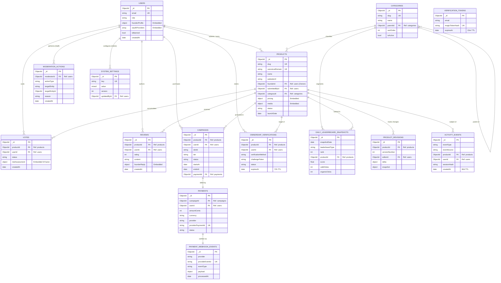

# LaunchProduct — Database Architecture & Design Specification (`database.md`)

**Document Version:** 1.0.0  
**Status:** Engineering Ready / Definitive Architecture  
**Database Platform:** MongoDB Atlas (M10+ Dedicated Cluster, Multi-AZ Replica Set, MongoDB 7+)  
**Object Document Mapper (ODM):** Mongoose 8+ / Native MongoDB Driver 6+  
**Supporting Ephemeral Store:** Redis 7 (Sorted Sets, Sliding Rate Limiters, BullMQ Streams)  
**Specification Source:** PRD v1.2.0, System Architecture v1.3.0, and DFD v1.0.0 (`dfd.md`)  
**Publication Date:** September 19, 2026  

---

## 1. Collection List

LaunchProduct utilizes **15 durable collections** in MongoDB Atlas serving as the authoritative system of record. High-speed ephemeral data (leaderboard score counters, sliding-window rate limiters, 15-minute slot reservation locks, and BullMQ queue streams) is mediated via **Redis 7** (`DS16: redis_ephemeral`).

### 1.1 Master Collections Catalog

| # | Collection Name | DFD Store ID | Storage Technology | Functional Purpose | Read/Write Profile | Retention / TTL | Immutability |
| :-: | :--- | :---: | :--- | :--- | :--- | :--- | :---: |
| **1** | `users` | **DS1** | MongoDB Atlas | User accounts, RBAC roles, auth credentials, and embedded founder profile. | Read-Heavy | Permanent | Mutable |
| **2** | `products` | **DS2** | MongoDB Atlas | Canonical product directory, metadata, lifecycle states, pricing, media. | Read-Ultra-Heavy | Permanent | Mutable |
| **3** | `categories` | **DS3** | MongoDB Atlas | Two-tier hierarchical taxonomy tree for product categorization. | Read-Heavy (In-Memory) | Permanent | Low Mutation |
| **4** | `votes` | **DS4** | MongoDB Atlas | Authenticated upvotes with embedded 6-factor anti-fraud risk telemetry. | High Write (Launches) | Permanent | Soft-Retract |
| **5** | `reviews` | **DS5** | MongoDB Atlas | Post-MVP community reviews, 1–5 star ratings, and founder responses. | Read-Heavy / Low Write | Permanent | Mutable |
| **6** | `campaigns` | **DS6** | MongoDB Atlas | First-party promotional slot bookings, scheduling, and lifecycle states. | Read-Medium / Low Write| Permanent | Mutable |
| **7** | `payments` | **DS7** | MongoDB Atlas | Merchant of Record (Paddle / Lemon Squeezy) financial transaction ledger. | Read-Low / Write-Low | Permanent | Immutable Audit |
| **8** | `payment_webhook_events` | **DS8** | MongoDB Atlas | Signed MoR webhook idempotency ledger preventing duplicate fulfillment. | Read-High / Write-Low | Permanent | Immutable Audit |
| **9** | `ownership_verifications` | **DS9** | MongoDB Atlas | 5-state product ownership claim records, challenge tokens, and DNS status. | Read-Medium / Write-Low| TTL: 72 Hours | Mutable |
| **10**| `product_revisions` | **DS10** | MongoDB Atlas | Append-only historical audit trail of product edits and field-level deltas. | Read-Low / Write-Low | Permanent | Immutable Audit |
| **11**| `daily_leaderboard_snapshots`| **DS11**| MongoDB Atlas | Immutable frozen daily rankings computed at UTC 23:59:59 with badges. | Read-Ultra-Heavy | Permanent | Immutable Archive|
| **12**| `activity_events` | **DS12** | MongoDB Atlas | Append-only operational event stream (clicks, views, claims, votes). | Write-Ultra-Heavy | TTL: 90 Days | Immutable Stream |
| **13**| `moderation_actions` | **DS13** | MongoDB Atlas | Audit history of moderator and administrator decisions and rationale. | Read-Low / Write-Low | Permanent | Immutable Audit |
| **14**| `verification_tokens` | **DS14** | MongoDB Atlas | Single-use SHA-256 hashed magic link login tokens. | High Write / High Read | TTL: 15 Minutes | Ephemeral Auth |
| **15**| `system_settings` | **DS15** | MongoDB Atlas | Dynamic system parameters (fraud weights, ranking gravity, rate limits). | Read-Ultra-Heavy | Permanent | Versioned Config|

### 1.2 Complementary Ephemeral Store (`DS16: redis_ephemeral`)

While MongoDB Atlas retains durable state, Redis 7 provides low-latency ephemeral operations:
- `leaderboard:today:votes` (ZSET): Real-time vote increment tracking (`ZINCRBY`).
- `rate:auth:ip:[subnet]` / `rate:vote:user:[id]` (Sliding window sorted sets): Edge rate limiting.
- `slot:reserve:[tier]:[slotId]` (String with 900s TTL): 15-minute checkout reservation hold.
- `click:dedup:[productId]:[sessionHash]` (String with 600s TTL): 10-minute click deduplication.
- `bull:*` (Redis Streams): BullMQ background job queues (`scraper`, `ranking`, `campaign`, `events`).

---

## 2. Schema

All collections are designed for strict enforcement under Mongoose 8+ and MongoDB 7+ Native JSON Schema Validation.

### 2.1 Collection: `users` (`DS1`)
Primary identity and authentication store.

| Field | BSON Type | Req | Default | Constraints / Allowed Values | Description |
| :--- | :--- | :---: | :--- | :--- | :--- |
| `_id` | `ObjectId` | Yes | `ObjectId()` | Auto-generated 24-char hex | Canonical user identifier. |
| `email` | `String` | Yes | None | Unique, lowercased, valid RFC 5322 | User's primary login credential. |
| `role` | `String` | Yes | `'HUNTER'` | Enum: `VISITOR`, `HUNTER`, `FOUNDER`, `MODERATOR`, `ADMIN` | Platform authorization role. |
| `oauthProviders` | `Array` | No | `[]` | Subdocument array (see below) | Connected OAuth identity providers. |
| `founderProfile` | `Object` | No | `{}` | Subdocument (see below) | Verified founder identity metadata. |
| `isBanned` | `Boolean` | Yes | `false` | `true`, `false` | Account administrative ban flag. |
| `banReason` | `String` | No | `null` | Max 500 chars | Rationale for account suspension. |
| `lastLoginAt` | `Date` | No | `null` | Valid ISO Date | Timestamp of most recent authentication. |
| `createdAt` | `Date` | Yes | `Date.now()` | Managed by `{ timestamps: true }` | Account creation timestamp. |
| `updatedAt` | `Date` | Yes | `Date.now()` | Managed by `{ timestamps: true }` | Last profile modification timestamp. |

**Subdocument: `users.oauthProviders`**
- `provider`: `String` (Req, Enum: `'google'`, `'github'`)
- `providerUserId`: `String` (Req)
- `linkedAt`: `Date` (Req, Default: `Date.now()`)

**Subdocument: `users.founderProfile`**
- `displayName`: `String` (Trimmed, 2–80 chars)
- `bio`: `String` (Max 300 chars)
- `avatarUrl`: `String` (Valid HTTPS URL)
- `twitterHandle`: `String` (Regex: `^@?[A-Za-z0-9_]{1,15}$`)
- `githubHandle`: `String` (Max 39 chars)
- `linkedinUrl`: `String` (Valid HTTPS URL)
- `websiteUrl`: `String` (Valid HTTPS URL)

---

### 2.2 Collection: `products` (`DS2`)
The core catalog entity representing software products, tools, and SaaS platforms.

| Field | BSON Type | Req | Default | Constraints / Allowed Values | Description |
| :--- | :--- | :---: | :--- | :--- | :--- |
| `_id` | `ObjectId` | Yes | `ObjectId()` | Auto-generated 24-char hex | Canonical product identifier. |
| `slug` | `String` | Yes | None | Unique, lowercase, slug format | URL slug for routing and directory URLs. |
| `canonicalDomain`| `String` | Yes | None | Unique, lowercase ASCII domain | Domain extracted from URL (e.g. `getacme.com`). |
| `name` | `String` | Yes | None | 2–100 chars, trimmed | Commercial product name. |
| `tagline` | `String` | Yes | None | 10–120 chars, trimmed | Concise elevator pitch. |
| `description` | `String` | Yes | None | Max 5,000 chars, sanitized markdown | Long-form product overview. |
| `websiteUrl` | `String` | Yes | None | Valid HTTPS URL, max 2,048 chars | External destination website URL. |
| `founderId` | `ObjectId` | No | `null` | Ref: `users._id` | Verified product owner (`FOUNDER`). |
| `submittedById` | `ObjectId` | Yes | None | Ref: `users._id` | User who initially submitted the listing. |
| `categoryId` | `ObjectId` | Yes | None | Ref: `categories._id` | Primary classification category. |
| `pricing` | `Object` | Yes | None | Subdocument (see below) | Standardized pricing structure. |
| `media` | `Object` | Yes | None | Subdocument (see below) | Logos, banners, screenshots. |
| `status` | `String` | Yes | `'DRAFT'` | Enum: `DRAFT`, `PENDING_REVIEW`, `SCHEDULED`, `LIVE`, `SUSPENDED`, `REJECTED`, `ARCHIVED`, `DELETED` | Lifecycle state. |
| `launchDate` | `Date` | No | `null` | UTC midnight (`YYYY-MM-DD`) | Scheduled platform launch date. |
| `rejectionReason`| `String`| No | `null` | Max 500 chars | Reason for editorial rejection. |
| `initialVersion`| `Number` | Yes | `1` | Integer >= 1 | Current revision pointer. |
| `createdAt` | `Date` | Yes | `Date.now()` | Managed by `{ timestamps: true }` | Ingestion timestamp. |
| `updatedAt` | `Date` | Yes | `Date.now()` | Managed by `{ timestamps: true }` | Update timestamp. |

**Subdocument: `products.pricing`**
- `pricingType`: `String` (Req, Enum: `'Free'`, `'Freemium'`, `'Paid'`, `'Contact'`)
- `startingPriceCents`: `Number` (Integer, Min: 0, Default: 0)
- `currency`: `String` (Req, Enum: `'USD'`, Default: `'USD'`)

**Subdocument: `products.media`**
- `logoUrl`: `String` (Req, Valid HTTPS URL)
- `bannerUrl`: `String` (No, Valid HTTPS URL)
- `screenshotUrls`: `[String]` (Max 5 valid HTTPS URLs)

---

### 2.3 Collection: `categories` (`DS3`)
Two-tier taxonomy structure for product classification.

| Field | BSON Type | Req | Default | Constraints / Allowed Values | Description |
| :--- | :--- | :---: | :--- | :--- | :--- |
| `_id` | `ObjectId` | Yes | `ObjectId()` | Auto-generated 24-char hex | Category identifier. |
| `slug` | `String` | Yes | None | Unique, lowercase slug | Routing identifier (e.g. `ai-copywriting`). |
| `name` | `String` | Yes | None | 2–50 chars, trimmed | Display title of category. |
| `description` | `String` | No | `null` | Max 300 chars | SEO meta description for category page. |
| `icon` | `String` | No | `null` | Lucide icon token or SVG path | Visual icon identifier. |
| `parentId` | `ObjectId` | No | `null` | Ref: `categories._id` | Parent category reference (two-tier maximum).|
| `sortOrder` | `Number` | Yes | `0` | Integer | Display ordering index. |
| `isActive` | `Boolean` | Yes | `true` | `true`, `false` | Directory visibility flag. |
| `createdAt` | `Date` | Yes | `Date.now()` | Managed by `{ timestamps: true }` | Creation timestamp. |
| `updatedAt` | `Date` | Yes | `Date.now()` | Managed by `{ timestamps: true }` | Modification timestamp. |

---

### 2.4 Collection: `votes` (`DS4`)
Tracks authenticated user upvotes and embeds comprehensive fraud risk scores.

| Field | BSON Type | Req | Default | Constraints / Allowed Values | Description |
| :--- | :--- | :---: | :--- | :--- | :--- |
| `_id` | `ObjectId` | Yes | `ObjectId()` | Auto-generated 24-char hex | Vote record identifier. |
| `productId` | `ObjectId` | Yes | None | Ref: `products._id` | Target product receiving the upvote. |
| `userId` | `ObjectId` | Yes | None | Ref: `users._id` | Authenticated user casting the vote. |
| `status` | `String` | Yes | `'VALID'` | Enum: `VALID`, `FLAGGED_FOR_REVIEW`, `QUARANTINED`, `REJECTED_BOT`, `RETRACTED`, `APPROVED_BY_MOD` | Fraud disposition status. |
| `riskAssessment` | `Object` | Yes | None | Subdocument (see below) | 6-factor anti-fraud evaluation telemetry. |
| `createdAt` | `Date` | Yes | `Date.now()` | Managed by `{ timestamps: true }` | Vote casting timestamp. |
| `updatedAt` | `Date` | Yes | `Date.now()` | Managed by `{ timestamps: true }` | Vote disposition modification timestamp. |

**Subdocument: `votes.riskAssessment`**
- `riskScore`: `Number` (Req, Integer: 0–100)
- `riskSignals`: `[String]` (Req, Values: `NEW_ACCOUNT`, `DATACENTER_ASN`, `SUBNET_BURST`, `VELOCITY_SPIKE`, `NO_NAV_TELEMETRY`, `FINGERPRINT_MATCH`, `PROXY_VPN`, `RATE_LIMIT_BURST`)
- `ipHash`: `String` (Req, SHA-256 HMAC of IP with rotating salt)
- `subnetHash`: `String` (Req, SHA-256 HMAC of `/24` IPv4 subnet)
- `asnNumber`: `Number` (Integer, BGP Autonomous System Number)
- `accountAgeHours`: `Number` (Float >= 0)
- `fingerprintHash`: `String` (SHA-256 canvas/browser signature)

---

### 2.5 Collection: `reviews` (`DS5`) — *Phase 2 (Post-MVP)*
User ratings and textual commentary.

| Field | BSON Type | Req | Default | Constraints / Allowed Values | Description |
| :--- | :--- | :---: | :--- | :--- | :--- |
| `_id` | `ObjectId` | Yes | `ObjectId()` | Auto-generated 24-char hex | Review identifier. |
| `productId` | `ObjectId` | Yes | None | Ref: `products._id` | Target product. |
| `userId` | `ObjectId` | Yes | None | Ref: `users._id` | Review author. |
| `rating` | `Number` | Yes | None | Integer: 1–5 | Star rating score. |
| `content` | `String` | Yes | None | 20–2,000 chars, markdown sanitized| Review body. |
| `founderReply` | `Object` | No | `null` | Subdocument (see below) | Official founder rebuttal or thanks. |
| `isFlagged` | `Boolean` | Yes | `false` | `true`, `false` | Flagged for content moderation. |
| `createdAt` | `Date` | Yes | `Date.now()` | Managed by `{ timestamps: true }` | Submission timestamp. |
| `updatedAt` | `Date` | Yes | `Date.now()` | Managed by `{ timestamps: true }` | Edit timestamp. |

**Subdocument: `reviews.founderReply`**
- `content`: `String` (Req, Max 1,000 chars)
- `repliedAt`: `Date` (Req, Default: `Date.now()`)

---

### 2.6 Collection: `campaigns` (`DS6`)
Monetized promotional inventory placements and reservations.

| Field | BSON Type | Req | Default | Constraints / Allowed Values | Description |
| :--- | :--- | :---: | :--- | :--- | :--- |
| `_id` | `ObjectId` | Yes | `ObjectId()` | Auto-generated 24-char hex | Campaign identifier. |
| `productId` | `ObjectId` | Yes | None | Ref: `products._id` | Sponsored product. |
| `userId` | `ObjectId` | Yes | None | Ref: `users._id` | Sponsoring founder user ID. |
| `slotId` | `String` | Yes | None | E.g. `homepage-hero-1`, `category-banner-3` | Fixed advertising slot position. |
| `tier` | `String` | Yes | None | Enum: `HOMEPAGE_HERO`, `CATEGORY_BANNER`, `NEWSLETTER_SPONSOR` | Sponsorship product package. |
| `status` | `String` | Yes | `'RESERVED'` | Enum: `RESERVED`, `PENDING_PAYMENT`, `ACTIVE`, `PAUSED`, `COMPLETED`, `CANCELLED` | Placement state. |
| `startsAt` | `Date` | Yes | None | ISO Date (UTC Midnight) | Campaign active launch date. |
| `endsAt` | `Date` | Yes | None | ISO Date (UTC Midnight) | Campaign natural expiration date. |
| `paymentId` | `ObjectId` | No | `null` | Ref: `payments._id` | Bound financial payment record. |
| `reservationExpiresAt`| `Date`| Yes | None | `startsAt + 15 minutes` | Slot hold expiration timestamp. |
| `createdAt` | `Date` | Yes | `Date.now()` | Managed by `{ timestamps: true }` | Booking creation timestamp. |
| `updatedAt` | `Date` | Yes | `Date.now()` | Managed by `{ timestamps: true }` | State update timestamp. |

---

### 2.7 Collection: `payments` (`DS7`)
Financial transaction ledger for merchant of record checkout payments.

| Field | BSON Type | Req | Default | Constraints / Allowed Values | Description |
| :--- | :--- | :---: | :--- | :--- | :--- |
| `_id` | `ObjectId` | Yes | `ObjectId()` | Auto-generated 24-char hex | Payment transaction identifier. |
| `campaignId` | `ObjectId` | Yes | None | Ref: `campaigns._id` | Associated campaign slot. |
| `userId` | `ObjectId` | Yes | None | Ref: `users._id` | Purchasing user ID. |
| `amountCents` | `Number` | Yes | None | Positive Integer >= 0 | Amount in smallest currency unit (cents). |
| `currency` | `String` | Yes | `'USD'` | ISO 4217 currency code | Transaction currency. |
| `provider` | `String` | Yes | None | Enum: `'paddle'`, `'lemon_squeezy'` | Merchant of Record provider. |
| `providerPaymentId` | `String`| No | `null` | Unique Sparse string | Provider transaction / charge ID. |
| `providerCustomerId` | `String`| No | `null` | Provider customer ID | External customer token. |
| `status` | `String` | Yes | `'PENDING'` | Enum: `PENDING`, `SUCCEEDED`, `FAILED`, `REFUNDED` | Settlement status. |
| `metadata` | `Object` | No | `{}` | Key-value store | Provider-specific receipt details. |
| `createdAt` | `Date` | Yes | `Date.now()` | Managed by `{ timestamps: true }` | Payment record created. |
| `updatedAt` | `Date` | Yes | `Date.now()` | Managed by `{ timestamps: true }` | Payment status finalized. |

---

### 2.8 Collection: `payment_webhook_events` (`DS8`)
Idempotency ledger recording all inbound signed webhook deliveries.

| Field | BSON Type | Req | Default | Constraints / Allowed Values | Description |
| :--- | :--- | :---: | :--- | :--- | :--- |
| `_id` | `ObjectId` | Yes | `ObjectId()` | Auto-generated 24-char hex | Webhook event identifier. |
| `provider` | `String` | Yes | None | Enum: `'paddle'`, `'lemon_squeezy'` | MoR webhook source. |
| `providerEventId`| `String` | Yes | None | Unique provider event ID | Provider's unique notification UUID. |
| `eventType` | `String` | Yes | None | E.g. `transaction.completed` | External event topic name. |
| `payload` | `Object` | Yes | None | Full raw parsed JSON payload | Exact webhook payload for audit. |
| `processedAt` | `Date` | Yes | `Date.now()` | ISO Date | Timestamp of fulfillment processing. |
| `createdAt` | `Date` | Yes | `Date.now()` | Managed by `{ timestamps: true }` | Arrival timestamp. |

---

### 2.9 Collection: `ownership_verifications` (`DS9`)
Manages domain ownership claim verification challenges with a strict 72-hour TTL.

| Field | BSON Type | Req | Default | Constraints / Allowed Values | Description |
| :--- | :--- | :---: | :--- | :--- | :--- |
| `_id` | `ObjectId` | Yes | `ObjectId()` | Auto-generated 24-char hex | Claim challenge identifier. |
| `productId` | `ObjectId` | Yes | None | Ref: `products._id` | Target product listing. |
| `userId` | `ObjectId` | Yes | None | Ref: `users._id` | Claimant user ID. |
| `verificationMethod`| `String`| Yes| None | Enum: `DNS_TXT`, `HTML_META`, `EMAIL_DOMAIN` | Claim technique selected. |
| `challengeToken` | `String` | Yes | None | 32-byte cryptographically secure token | Expected validation token. |
| `status` | `String` | Yes | `'PENDING'` | Enum: `PENDING`, `CHALLENGE_ISSUED`, `VERIFIED`, `REJECTED`, `DISPUTED`, `FAILED_EXPIRED` | Claim lifecycle state. |
| `expiresAt` | `Date` | Yes | `now + 72h` | TTL Index target (`72 hours`) | Automatic drop timestamp. |
| `verifiedAt` | `Date` | No | `null` | ISO Date | Timestamp of successful verification. |
| `createdAt` | `Date` | Yes | `Date.now()` | Managed by `{ timestamps: true }` | Claim initiation timestamp. |
| `updatedAt` | `Date` | Yes | `Date.now()` | Managed by `{ timestamps: true }` | Claim update timestamp. |

---

### 2.10 Collection: `product_revisions` (`DS10`)
Immutable versioned audit trail recording field-level delta changes to product listings.

| Field | BSON Type | Req | Default | Constraints / Allowed Values | Description |
| :--- | :--- | :---: | :--- | :--- | :--- |
| `_id` | `ObjectId` | Yes | `ObjectId()` | Auto-generated 24-char hex | Revision record identifier. |
| `productId` | `ObjectId` | Yes | None | Ref: `products._id` | Target product listing. |
| `versionNumber` | `Number` | Yes | None | Integer >= 1 | Incremental revision number. |
| `editorId` | `ObjectId` | Yes | None | Ref: `users._id` | User or moderator who made the edit. |
| `delta` | `Object` | Yes | None | BSON diff mapping | Diff capturing before/after modifications. |
| `snapshot` | `Object` | Yes | None | Complete frozen product document | Point-in-time full document snapshot. |
| `createdAt` | `Date` | Yes | `Date.now()` | Immutable write | Timestamp revision was authored. |

---

### 2.11 Collection: `daily_leaderboard_snapshots` (`DS11`)
Frozen immutable daily competitive leaderboard records frozen at UTC 23:59:59.

| Field | BSON Type | Req | Default | Constraints / Allowed Values | Description |
| :--- | :--- | :---: | :--- | :--- | :--- |
| `_id` | `ObjectId` | Yes | `ObjectId()` | Auto-generated 24-char hex | Snapshot item identifier. |
| `snapshotDate` | `Date` | Yes | None | UTC Midnight (`YYYY-MM-DD`) | Historical date of the frozen leaderboard. |
| `leaderboardType`| `String`| Yes| `'DAILY'`| Enum: `'DAILY'`, `'WEEKLY'`, `'CATEGORY'` | Leaderboard scope. |
| `categoryId` | `ObjectId` | No | `null` | Ref: `categories._id` | Present only when `leaderboardType = 'CATEGORY'`.|
| `rank` | `Number` | Yes | None | Integer >= 1 | Competitive finish position. |
| `productId` | `ObjectId` | Yes | None | Ref: `products._id` | Product placed in this rank. |
| `score` | `Number` | Yes | None | Float >= 0 | Final calculated $S_{\text{launch}}$ score. |
| `validVotes` | `Number` | Yes | None | Integer >= 0 | Total valid unquarantined upvotes. |
| `organicClicks` | `Number` | Yes | None | Integer >= 0 | Qualified unique organic outbound clicks. |
| `algorithmVersion`| `String`| Yes| None | E.g. `'v1.0.0-algo'` | Formula version utilized for calculation. |
| `createdAt` | `Date` | Yes | `Date.now()` | Immutable write | Frozen execution timestamp. |

---

### 2.12 Collection: `activity_events` (`DS12`)
High-throughput operational ledger capturing all analytical events with a 90-day native TTL.

| Field | BSON Type | Req | Default | Constraints / Allowed Values | Description |
| :--- | :--- | :---: | :--- | :--- | :--- |
| `_id` | `ObjectId` | Yes | `ObjectId()` | Auto-generated 24-char hex | Event stream identifier. |
| `eventType` | `String` | Yes | None | Enum (see below) | Domain event classification. |
| `eventSource` | `String` | Yes | `'ORGANIC'` | Enum: `ORGANIC`, `SPONSORED`, `BOT`, `FRAUD`, `INTERNAL`, `TEST` | Traffic classification firewall tag. |
| `productId` | `ObjectId` | No | `null` | Ref: `products._id` | Associated product (if applicable). |
| `userId` | `ObjectId` | No | `null` | Ref: `users._id` | Actor user ID (if authenticated). |
| `sessionHash` | `String` | No | `null` | 64-char hex HMAC | Rotating daily salt session hash for dedup. |
| `metadata` | `Object` | No | `{}` | Event-specific context payload | Source path, campaign tier, latency, etc. |
| `createdAt` | `Date` | Yes | `Date.now()` | TTL Index Target (`90 days`) | Event arrival timestamp. |

*Allowed `activity_events.eventType` values:*  
`'AUTH_MAGIC_LINK_VERIFIED'`, `'AUTH_OAUTH_LOGIN'`, `'PRODUCT_SUBMITTED'`, `'PRODUCT_CONFIRMED'`, `'PRODUCT_APPROVED'`, `'PRODUCT_REJECTED'`, `'VOTE_CAST'`, `'VOTE_FLAGGED'`, `'VOTE_QUARANTINED'`, `'OUTBOUND_CLICK'`, `'CAMPAIGN_RESERVED'`, `'CAMPAIGN_STARTED'`, `'CAMPAIGN_EXPIRED'`, `'OWNERSHIP_CLAIMED'`, `'LEADERBOARD_FROZEN'`.

---

### 2.13 Collection: `moderation_actions` (`DS13`)
Immutable decision log for moderator and administrator operational triage.

| Field | BSON Type | Req | Default | Constraints / Allowed Values | Description |
| :--- | :--- | :---: | :--- | :--- | :--- |
| `_id` | `ObjectId` | Yes | `ObjectId()` | Auto-generated 24-char hex | Action audit identifier. |
| `moderatorId` | `ObjectId` | Yes | None | Ref: `users._id` | Staff member executing the action. |
| `actionType` | `String` | Yes | None | Enum: `APPROVE_PRODUCT`, `REJECT_PRODUCT`, `OVERTURN_VOTE`, `RESOLVE_CLAIM`, `BAN_USER`, `UPDATE_SETTINGS` | Action category. |
| `targetEntity` | `String` | Yes | None | Enum: `'product'`, `'vote'`, `'claim'`, `'user'`, `'setting'` | Target collection type. |
| `targetEntityId`| `ObjectId`| Yes| None | Target document `_id` | Referenced document identifier. |
| `reason` | `String` | Yes | None | 5–1,000 chars | Justification note. |
| `previousState` | `Object` | Yes | None | Document sub-snapshot | State prior to modification. |
| `newState` | `Object` | Yes | None | Document sub-snapshot | Resulting modified state. |
| `createdAt` | `Date` | Yes | `Date.now()` | Immutable write | Decision timestamp. |

---

### 2.14 Collection: `verification_tokens` (`DS14`)
Single-use ephemeral tokens with a 15-minute native TTL for passwordless authentication.

| Field | BSON Type | Req | Default | Constraints / Allowed Values | Description |
| :--- | :--- | :---: | :--- | :--- | :--- |
| `_id` | `ObjectId` | Yes | `ObjectId()` | Auto-generated 24-char hex | Token record identifier. |
| `email` | `String` | Yes | None | Lowercased RFC 5322 string | Target user email address. |
| `magicTokenHash`| `String` | Yes | None | Unique SHA-256 hex digest (64 chars)| Hashed secret verified timing-safely. |
| `expiresAt` | `Date` | Yes | `now + 15m` | TTL Index Target (`15 minutes`) | Automatic TTL drop timestamp. |
| `createdAt` | `Date` | Yes | `Date.now()` | ISO Date | Issuance timestamp. |

---

### 2.15 Collection: `system_settings` (`DS15`)
Dynamic system-wide algorithmic, anti-fraud, and rate limit settings.

| Field | BSON Type | Req | Default | Constraints / Allowed Values | Description |
| :--- | :--- | :---: | :--- | :--- | :--- |
| `_id` | `ObjectId` | Yes | `ObjectId()` | Auto-generated 24-char hex | Setting document identifier. |
| `key` | `String` | Yes | None | Unique, uppercase identifier | Configuration key name. |
| `value` | `Mixed` | Yes | None | Structured BSON / JSON | Setting payload. |
| `version` | `Number` | Yes | `1` | Integer >= 1 | Incremental configuration version. |
| `description` | `String` | Yes | None | Max 300 chars | Documentation of config utility. |
| `updatedById` | `ObjectId` | Yes | None | Ref: `users._id` | Administrator who made the update. |
| `createdAt` | `Date` | Yes | `Date.now()` | Managed by `{ timestamps: true }` | Initialization timestamp. |
| `updatedAt` | `Date` | Yes | `Date.now()` | Managed by `{ timestamps: true }` | Last modified timestamp. |

---

## 3. Relationship

### 3.1 Entity Relationship Cardinality Matrix

| Parent Entity | Child Entity | Cardinality | Implementation Strategy | Referential Action | Business Rationale |
| :--- | :--- | :---: | :--- | :--- | :--- |
| `users` | `users.founderProfile` | **1:1** | **Embedded Document** | Cascade on Parent | Co-fetched on every session; bounded size (< 1 KB). |
| `users` | `products` (submittedById) | **1:N** | **Referenced (`ObjectId`)** | Restrict Delete | Unbounded; user can submit unlimited products over time. |
| `users` | `products` (founderId / owner)| **1:N** | **Referenced (`ObjectId`)** | Set Null on Erasure| Founder can own multiple products; soft-delete on user. |
| `products` | `products.pricing` | **1:1** | **Embedded Document** | Cascade on Parent | Co-rendered on product cards; bounded metadata (< 200 bytes).|
| `products` | `products.media` | **1:1** | **Embedded Document** | Cascade on Parent | Co-rendered on cards/pages; bounded array (max 5 URLs). |
| `categories` | `categories` (parentId) | **1:N** | **Referenced (`ObjectId`)** | Restrict Delete | Self-referencing hierarchical taxonomy tree. |
| `categories` | `products` | **1:N** | **Referenced (`ObjectId`)** | Restrict Delete | Taxonomy classification across thousands of products. |
| `products` | `votes` | **1:N** | **Referenced (`ObjectId`)** | Soft-Retract / Archive| High cardinality (thousands of votes per product). |
| `users` | `votes` | **1:N** | **Referenced (`ObjectId`)** | Soft-Retract / Archive| User voting history; compound unique prevents duplicates. |
| `votes` | `votes.riskAssessment` | **1:1** | **Embedded Document** | Cascade on Parent | Point-in-time audit snapshot tied exclusively to one vote. |
| `products` | `reviews` | **1:N** | **Referenced (`ObjectId`)** | Restrict Delete | Post-MVP community reviews; independent pagination. |
| `users` | `reviews` | **1:N** | **Referenced (`ObjectId`)** | Restrict Delete | 1 review per user per product. |
| `products` | `product_revisions` | **1:N** | **Referenced (`ObjectId`)** | Immutable Cascade | Avoids MongoDB 16MB document bloat (unbounded array anti-pattern).|
| `products` | `ownership_verifications`| **1:N** | **Referenced (`ObjectId`)** | TTL Auto-Purge | Ephemeral 72-hour claim challenge lifecycle. |
| `products` | `campaigns` | **1:N** | **Referenced (`ObjectId`)** | Restrict Delete | Commercial inventory placements booked for a product. |
| `campaigns` | `payments` | **1:1** | **Referenced (`ObjectId`)** | Restrict Delete | Financial record separation; independent audit and compliance. |
| `payments` | `payment_webhook_events` | **1:1** | **Referenced (`providerPaymentId`)** | Immutable Audit | Cryptographic idempotency binding between webhook and payment. |
| `products` | `daily_leaderboard_snapshots`|**1:N**| **Referenced (`ObjectId`)** | Immutable Archive | Immutable frozen historical rankings computed daily. |
| `users` (Moderator)| `moderation_actions`| **1:N** | **Referenced (`ObjectId`)** | Immutable Audit | Staff action audit log for governance and compliance. |

### 3.2 Architectural Justification: Embedding vs. Referencing

```
┌────────────────────────────────────────────────────────────────────────────────────────┐
│                               ARCHITECTURAL STRATEGY                                   │
├───────────────────────────────────────────┬────────────────────────────────────────────┤
│           EMBEDDED PATTERN                │            REFERENCED PATTERN              │
├───────────────────────────────────────────┼────────────────────────────────────────────┤
│ • users.founderProfile                    │ • products (referenced by founderId)       │
│ • products.pricing                        │ • votes (referenced by productId, userId)  │
│ • products.media                          │ • product_revisions (referenced productId) │
│ • votes.riskAssessment                    │ • categories (hierarchical parentId)       │
│ • reviews.founderReply                    │ • campaigns & payments (referenced)        │
├───────────────────────────────────────────┼────────────────────────────────────────────┤
│ Rationale:                                │ Rationale:                                 │
│ 1. High Cohesion & 1:1 Cardinality        │ 1. Unbounded Array Anti-Pattern Prevention │
│ 2. Read Co-locality (Single Round-Trip)   │ 2. High Cardinality & Independent Growth   │
│ 3. Atomic Mutation within Document        │ 3. Independent Indexing & Pipeline Memory  │
│ 4. Zero Risk of 16MB Document Bloat       │ 4. Multi-Tenant Architectural Isolation    │
└───────────────────────────────────────────┴────────────────────────────────────────────┘
```

---

## 4. Index

The indexing architecture strictly adheres to the **ESR (Equality, Sort, Range)** rule. Over-indexing is explicitly avoided to safeguard write performance on high-throughput ingest paths.

### 4.1 Master Index Table

| Collection | Index Key Specification | Type | Justification / Query Path | ESR Compliance |
| :--- | :--- | :--- | :--- | :--- |
| `users` | `{ email: 1 }` | **Unique** | Primary credential lookup during magic link and OAuth handshake. | Equality |
| `users` | `{ role: 1 }` | Secondary | Filter founders, moderators, or admin staff in admin consoles. | Equality |
| `users` | `{ "oauthProviders.provider": 1, "oauthProviders.providerUserId": 1 }` | Compound | Fast OAuth callback resolution to provisioned user. | Equality, Equality |
| `products` | `{ slug: 1 }` | **Unique** | Canonical PDP (Product Detail Page) routing and lookup. | Equality |
| `products` | `{ canonicalDomain: 1 }` | **Unique** | Enforces the strict business rule: 1 product listing per apex domain. | Equality |
| `products` | `{ categoryId: 1, status: 1 }` | Compound | Category navigation directory views (`status = 'LIVE'`). | Equality, Equality |
| `products` | `{ launchDate: 1, status: 1 }` | Compound | Daily launch discovery query & UTC 23:59:59 freeze pipeline. | Equality, Equality |
| `products` | `{ status: 1, createdAt: -1 }` | Compound | Moderator triage desk sorting pending products by oldest first. | Equality, Sort |
| `products` | `{ founderId: 1, status: 1 }` | Compound | Founder dashboard loading active products owned by founder. | Equality, Equality |
| `products` | `{ name: "text", tagline: "text", description: "text" }` | **Text** | Full-text directory search with weights (`name: 10, tagline: 5, desc: 1`). | Keyword Score |
| `categories` | `{ slug: 1 }` | **Unique** | Category URL route resolution. | Equality |
| `categories` | `{ parentId: 1, sortOrder: 1 }` | Compound | Hierarchy rendering; subcategory lookup ordered by display priority. | Equality, Sort |
| `votes` | `{ productId: 1, userId: 1 }` | **Unique Compound** | Guarantees strict idempotency: exactly 1 vote per user per product. | Equality, Equality |
| `votes` | `{ productId: 1, status: 1, createdAt: 1 }` | Compound | Aggregation pipeline filtering valid votes and calculating vote velocity.| Equality, Equality, Range |
| `votes` | `{ status: 1, createdAt: -1 }` | Compound | Anti-fraud console listing quarantined votes for review. | Equality, Sort |
| `votes` | `{ subnetHash: 1, productId: 1, createdAt: 1 }` | Compound | 6-factor fraud check: detects > 3 votes from same `/24` subnet in 1 hour.| Equality, Equality, Range |
| `reviews` | `{ productId: 1, userId: 1 }` | **Unique Compound** | Enforces 1 review per product per hunter. | Equality, Equality |
| `reviews` | `{ productId: 1, createdAt: -1 }` | Compound | Product detail page review stream ordered chronologically. | Equality, Sort |
| `campaigns` | `{ slotId: 1, startsAt: 1, endsAt: 1 }` | Compound | Slot inventory availability check during checkout reservation. | Equality, Range, Range |
| `campaigns` | `{ status: 1, endsAt: 1 }` | Compound | BullMQ scheduled worker releasing expired promotional slots. | Equality, Range |
| `campaigns` | `{ productId: 1, status: 1 }` | Compound | Verifies whether a product currently has active sponsored visibility. | Equality, Equality |
| `payments` | `{ providerPaymentId: 1 }` | **Unique Sparse**| Prevents duplicate payment entry from external MoR charges. | Equality |
| `payments` | `{ campaignId: 1 }` | Secondary | Query payment records attached to a campaign. | Equality |
| `payment_webhook_events`| `{ provider: 1, providerEventId: 1 }` | **Unique Compound** | Cryptographic webhook deduplication; guarantees processing at-most-once.| Equality, Equality |
| `ownership_verifications`| `{ expiresAt: 1 }` | **TTL Index** | Native MongoDB background purge after 72 hours (`expireAfterSeconds: 0`).| TTL Purge |
| `ownership_verifications`| `{ productId: 1 }` | **Partial Unique**| Enforces only 1 active verified founder claim per product (`status = 'VERIFIED'`).| Equality (Partial) |
| `product_revisions`| `{ productId: 1, versionNumber: 1 }` | **Unique Compound** | Strict sequential version numbering per product. | Equality, Equality |
| `daily_leaderboard_snapshots`| `{ snapshotDate: 1, leaderboardType: 1, rank: 1 }`| **Unique Compound** | Idempotency guard for frozen leaderboard: exactly 1 product per rank. | Equality, Equality, Equality |
| `daily_leaderboard_snapshots`| `{ productId: 1, snapshotDate: -1 }` | Compound | Historical badge embed generator querying historical badges. | Equality, Sort |
| `daily_leaderboard_snapshots`| `{ snapshotDate: 1, leaderboardType: 1, score: -1 }`| Compound | Historical directory leaderboard archive queries. | Equality, Equality, Sort |
| `activity_events`| `{ createdAt: 1 }` | **TTL Index** | Auto-purges events older than 90 days (`expireAfterSeconds: 7776000`). | TTL Purge |
| `activity_events`| `{ productId: 1, eventSource: 1, eventType: 1, createdAt: 1 }`| Compound | Founder analytics pipeline: isolates organic clicks from sponsored. | Equality, Equality, Equality, Range |
| `activity_events`| `{ sessionHash: 1, productId: 1, eventType: 1 }` | Compound | 10-minute clickstream deduplication check. | Equality, Equality, Equality |
| `moderation_actions`| `{ moderatorId: 1, createdAt: -1 }` | Compound | Moderator activity log and staff performance audits. | Equality, Sort |
| `moderation_actions`| `{ targetEntity: 1, targetEntityId: 1 }` | Compound | Entity audit trail: history of all administrative changes on a product. | Equality, Equality |
| `verification_tokens`| `{ expiresAt: 1 }` | **TTL Index** | Automatically drops tokens older than 15 minutes (`expireAfterSeconds: 0`). | TTL Purge |
| `verification_tokens`| `{ magicTokenHash: 1 }` | **Unique** | Constant-time hash verification lookup. | Equality |
| `system_settings` | `{ key: 1 }` | **Unique** | Unique configuration key constraint. | Equality |

---

## 5. Validation

Validation is implemented at two discrete architectural boundaries:
1. **MongoDB Native JSON Schema Validation (`$jsonSchema`)**: Enforced at the storage engine level with `validationLevel: 'strict'` and `validationAction: 'error'`.
2. **Application Mongoose Layer Validation**: Enforcing business regex, sanitized markdown, and cryptographic digests.

### 5.1 MongoDB Native Collection Validators (`$jsonSchema`)

#### 5.1.1 Collection: `users`
```javascript
db.createCollection("users", {
  validator: {
    $jsonSchema: {
      bsonType: "object",
      required: ["email", "role", "isBanned", "createdAt", "updatedAt"],
      properties: {
        _id: { bsonType: "objectId" },
        email: {
          bsonType: "string",
          pattern: "^[a-zA-Z0-9._%+-]+@[a-zA-Z0-9.-]+\\.[a-zA-Z]{2,}$",
          description: "Must be a valid, lowercased email address"
        },
        role: {
          enum: ["VISITOR", "HUNTER", "FOUNDER", "MODERATOR", "ADMIN"],
          description: "Must match a valid system role"
        },
        isBanned: { bsonType: "bool" },
        founderProfile: {
          bsonType: "object",
          properties: {
            displayName: { bsonType: "string", maxLength: 80 },
            bio: { bsonType: "string", maxLength: 300 },
            avatarUrl: { bsonType: "string", pattern: "^https?://.*" },
            twitterHandle: { bsonType: "string", pattern: "^@?[A-Za-z0-9_]{1,15}$" },
            githubHandle: { bsonType: "string", maxLength: 39 },
            linkedinUrl: { bsonType: "string", pattern: "^https?://.*" },
            websiteUrl: { bsonType: "string", pattern: "^https?://.*" }
          }
        }
      }
    }
  }
});
```

#### 5.1.2 Collection: `products`
```javascript
db.createCollection("products", {
  validator: {
    $jsonSchema: {
      bsonType: "object",
      required: ["slug", "canonicalDomain", "name", "tagline", "description", "websiteUrl", "submittedById", "categoryId", "pricing", "media", "status", "initialVersion"],
      properties: {
        _id: { bsonType: "objectId" },
        slug: {
          bsonType: "string",
          pattern: "^[a-z0-9]+(?:-[a-z0-9]+)*$",
          maxLength: 100
        },
        canonicalDomain: {
          bsonType: "string",
          pattern: "^[a-z0-9.-]+\\.[a-z]{2,}$"
        },
        name: { bsonType: "string", minLength: 2, maxLength: 100 },
        tagline: { bsonType: "string", minLength: 10, maxLength: 120 },
        description: { bsonType: "string", maxLength: 5000 },
        websiteUrl: { bsonType: "string", pattern: "^https?://.*", maxLength: 2048 },
        founderId: { bsonType: ["objectId", "null"] },
        submittedById: { bsonType: "objectId" },
        categoryId: { bsonType: "objectId" },
        pricing: {
          bsonType: "object",
          required: ["pricingType", "currency"],
          properties: {
            pricingType: { enum: ["Free", "Freemium", "Paid", "Contact"] },
            startingPriceCents: { bsonType: ["int", "long", "double"], minimum: 0 },
            currency: { enum: ["USD"] }
          }
        },
        media: {
          bsonType: "object",
          required: ["logoUrl"],
          properties: {
            logoUrl: { bsonType: "string", pattern: "^https?://.*" },
            bannerUrl: { bsonType: ["string", "null"], pattern: "^https?://.*" },
            screenshotUrls: {
              bsonType: "array",
              maxItems: 5,
              items: { bsonType: "string", pattern: "^https?://.*" }
            }
          }
        },
        status: {
          enum: ["DRAFT", "PENDING_REVIEW", "SCHEDULED", "LIVE", "SUSPENDED", "REJECTED", "ARCHIVED", "DELETED"]
        },
        initialVersion: { bsonType: "int", minimum: 1 }
      }
    }
  }
});
```

#### 5.1.3 Collection: `votes`
```javascript
db.createCollection("votes", {
  validator: {
    $jsonSchema: {
      bsonType: "object",
      required: ["productId", "userId", "status", "riskAssessment"],
      properties: {
        _id: { bsonType: "objectId" },
        productId: { bsonType: "objectId" },
        userId: { bsonType: "objectId" },
        status: {
          enum: ["VALID", "FLAGGED_FOR_REVIEW", "QUARANTINED", "REJECTED_BOT", "RETRACTED", "APPROVED_BY_MOD"]
        },
        riskAssessment: {
          bsonType: "object",
          required: ["riskScore", "riskSignals", "ipHash", "subnetHash"],
          properties: {
            riskScore: { bsonType: "int", minimum: 0, maximum: 100 },
            riskSignals: { bsonType: "array", items: { bsonType: "string" } },
            ipHash: { bsonType: "string", minLength: 64, maxLength: 64 },
            subnetHash: { bsonType: "string", minLength: 64, maxLength: 64 }
          }
        }
      }
    }
  }
});
```

---

## 6. Aggregation

The following production aggregation pipelines execute high-performance analytical and operational queries.

### 6.1 Daily UTC 23:59:59 Freeze Pipeline (`P9.0`)
Computes the immutable daily leaderboard scores using the mathematical formula:
$$S_{\text{launch}} = \log_{10}(V + 1) \cdot w_v + \log_{10}(U_{\text{organic\_clicks}} + 1) \cdot w_c - \lambda \cdot \Delta t$$

```javascript
/**
 * Daily UTC Freeze Leaderboard Aggregation Pipeline
 * Executed by BullMQ Cron Worker at 23:59:59 UTC
 * Parameters: targetDate (e.g. "2026-09-18T00:00:00.000Z"), wv=1.0, wc=0.4, lambda=0.05
 */
const targetStart = new Date("2026-09-18T00:00:00.000Z");
const targetEnd   = new Date("2026-09-18T23:59:59.999Z");
const wv = 1.0;
const wc = 0.4;
const lambda = 0.05;

const pipeline = [
  // 1. Filter products scheduled for or live on target launch date
  {
    $match: {
      launchDate: { $gte: targetStart, $lte: targetEnd },
      status: "LIVE"
    }
  },

  // 2. Correlate valid upvotes (status == 'VALID' or 'APPROVED_BY_MOD')
  {
    $lookup: {
      from: "votes",
      let: { pId: "$_id" },
      pipeline: [
        {
          $match: {
            $expr: {
              $and: [
                { $eq: ["$productId", "$$pId"] },
                { $in: ["$status", ["VALID", "APPROVED_BY_MOD"]] }
              ]
            }
          }
        },
        { $count: "count" }
      ],
      as: "voteMetrics"
    }
  },

  // 3. Correlate qualified unique organic clicks from activity_events (firewalled from sponsored)
  {
    $lookup: {
      from: "activity_events",
      let: { pId: "$_id" },
      pipeline: [
        {
          $match: {
            $expr: {
              $and: [
                { $eq: ["$productId", "$$pId"] },
                { $eq: ["$eventType", "OUTBOUND_CLICK"] },
                { $eq: ["$eventSource", "ORGANIC"] },
                { $gte: ["$createdAt", targetStart] },
                { $lte: ["$createdAt", targetEnd] }
              ]
            }
          }
        },
        { $group: { _id: "$sessionHash" } }, // Deduplicate by sessionHash
        { $count: "count" }
      ],
      as: "clickMetrics"
    }
  },

  // 4. Project metrics with null safety
  {
    $project: {
      _id: 1,
      name: 1,
      slug: 1,
      categoryId: 1,
      V: { $ifNull: [{ $arrayElemAt: ["$voteMetrics.count", 0] }, 0] },
      U: { $ifNull: [{ $arrayElemAt: ["$clickMetrics.count", 0] }, 0] }
    }
  },

  // 5. Calculate logarithmic formula with time decay (Delta t = 0 for launch day)
  {
    $addFields: {
      score: {
        $add: [
          { $multiply: [{ $log10: { $add: ["$V", 1] } }, wv] },
          { $multiply: [{ $log10: { $add: ["$U", 1] } }, wc] }
        ]
      }
    }
  },

  // 6. Sort descending by computed score, then raw votes as tie-breaker
  {
    $sort: { score: -1, V: -1, _id: 1 }
  },

  // 7. Calculate dense ordinal rank
  {
    $setWindowFields: {
      sortBy: { score: -1, V: -1 },
      output: {
        rank: { $denseRank: {} }
      }
    }
  },

  // 8. Format documents for insertion into daily_leaderboard_snapshots
  {
    $project: {
      _id: 0,
      snapshotDate: targetStart,
      leaderboardType: "DAILY",
      rank: "$rank",
      productId: "$_id",
      score: { $round: ["$score", 4] },
      validVotes: "$V",
      organicClicks: "$U",
      algorithmVersion: "v1.0.0-algo",
      createdAt: "$$NOW"
    }
  }
];

// Execution: bulkWrite into daily_leaderboard_snapshots
```

---

### 6.2 Founder 30-Day Analytics Dashboard Pipeline
Aggregates referral clicks, impressions, and CTR time-bucketed daily.

```javascript
/**
 * Founder Analytics Pipeline
 * Target: Single Product ID over the last 30 days
 */
const targetProductId = new ObjectId("66ea01112222333344445555");
const thirtyDaysAgo = new Date(Date.now() - 30 * 24 * 60 * 60 * 1000);

const founderAnalyticsPipeline = [
  {
    $match: {
      productId: targetProductId,
      createdAt: { $gte: thirtyDaysAgo },
      eventType: { $in: ["OUTBOUND_CLICK", "PRODUCT_IMPRESSION"] }
    }
  },
  {
    $group: {
      _id: {
        date: { $dateToString: { format: "%Y-%m-%d", date: "$createdAt" } },
        type: "$eventType",
        source: "$eventSource"
      },
      count: { $sum: 1 }
    }
  },
  {
    $group: {
      _id: "$_id.date",
      metrics: {
        $push: {
          type: "$_id.type",
          source: "$_id.source",
          count: "$count"
        }
      }
    }
  },
  {
    $sort: { _id: 1 }
  }
];
```

---

### 6.3 Anti-Fraud Subnet Density & Velocity Detection Pipeline
Flags coordinated burst attacks from identical `/24` IPv4 subnets.

```javascript
/**
 * Subnet Density Detection Pipeline
 * Runs every 5 minutes checking votes cast in the last 60 minutes
 */
const oneHourAgo = new Date(Date.now() - 60 * 60 * 1000);

const antiFraudSubnetPipeline = [
  {
    $match: {
      createdAt: { $gte: oneHourAgo }
    }
  },
  {
    $group: {
      _id: {
        productId: "$productId",
        subnetHash: "$riskAssessment.subnetHash"
      },
      voteCount: { $sum: 1 },
      voteIds: { $push: "$_id" }
    }
  },
  {
    $match: {
      voteCount: { $gt: 3 } // Alert threshold: > 3 votes from same /24 subnet per hour
    }
  },
  {
    $lookup: {
      from: "products",
      localField: "_id.productId",
      foreignField: "_id",
      as: "product"
    }
  },
  {
    $project: {
      productId: "$_id.productId",
      productName: { $arrayElemAt: ["$product.name", 0] },
      subnetHash: "$_id.subnetHash",
      voteCount: 1,
      voteIds: 1
    }
  }
];
```

---

### 6.4 Faceted Public Directory Search & Filter Pipeline (`P4.0`)
Combines text search, category filtering, pricing facet, and pagination.

```javascript
/**
 * Public Directory Search Pipeline with Facets
 */
const searchQuery = "analytics";
const targetCategory = new ObjectId("66ea00001111222233334444");
const page = 1;
const limit = 20;

const directorySearchPipeline = [
  {
    $match: {
      $text: { $search: searchQuery },
      status: "LIVE",
      categoryId: targetCategory
    }
  },
  {
    $facet: {
      paginatedResults: [
        { $sort: { score: { $meta: "textScore" }, launchDate: -1 } },
        { $skip: (page - 1) * limit },
        { $limit: limit },
        {
          $lookup: {
            from: "categories",
            localField: "categoryId",
            foreignField: "_id",
            as: "category"
          }
        },
        {
          $project: {
            name: 1,
            slug: 1,
            tagline: 1,
            pricing: 1,
            media: 1,
            launchDate: 1,
            categoryName: { $arrayElemAt: ["$category.name", 0] },
            textScore: { $meta: "textScore" }
          }
        }
      ],
      totalCount: [
        { $count: "count" }
      ],
      pricingBreakdown: [
        { $group: { _id: "$pricing.pricingType", count: { $sum: 1 } } }
      ]
    }
  }
];
```

---

## 7. Transaction

To preserve financial and operational integrity, multi-document ACID transactions (`session.withTransaction()`) are strictly isolated to **3 mission-critical workflows**. All other mutations utilize single-document atomic updates.

### 7.1 Transaction Specifications

| Transaction ID | Name | Collections Mutated | Isolation Level | Write Concern | Trigger |
| :---: | :--- | :--- | :--- | :--- | :--- |
| **T-1** | MoR Payment & Campaign Activation | `payments`, `campaigns`, `payment_webhook_events`, `activity_events` | Snapshot | `{ w: "majority", j: true }` | Verified MoR webhook (`transaction.completed`) |
| **T-2** | Ownership Claim & Founder Promotion | `ownership_verifications`, `products`, `users`, `activity_events` | Snapshot | `{ w: "majority", j: true }` | DoH DNS TXT / HTML Meta match confirmation |
| **T-3** | Product Content Revision & Transition | `products`, `product_revisions`, `activity_events` | Snapshot | `{ w: "majority", j: true }` | Founder confirms draft or updates live metadata |

---

### 7.2 Transaction Code Implementations

#### 7.2.1 Transaction T-1: MoR Payment & Campaign Activation
```typescript
import mongoose from "mongoose";

interface MoRPaymentInput {
  provider: "paddle" | "lemon_squeezy";
  providerEventId: string;
  providerPaymentId: string;
  providerCustomerId: string;
  campaignId: string;
  userId: string;
  amountCents: number;
  currency: string;
  rawPayload: Record<string, any>;
}

export async function executeMoRPaymentTransaction(input: MoRPaymentInput): Promise<void> {
  const session = await mongoose.startSession();

  try {
    await session.withTransaction(async () => {
      // 1. Check idempotency: ensure webhook has not been processed
      const existingEvent = await mongoose.model("PaymentWebhookEvent").findOne({
        provider: input.provider,
        providerEventId: input.providerEventId,
      }).session(session);

      if (existingEvent) {
        // Idempotent duplicate: early exit commit
        return;
      }

      // 2. Insert financial payment record
      const [payment] = await mongoose.model("Payment").create([
        {
          campaignId: new mongoose.Types.ObjectId(input.campaignId),
          userId: new mongoose.Types.ObjectId(input.userId),
          amountCents: input.amountCents,
          currency: input.currency,
          provider: input.provider,
          providerPaymentId: input.providerPaymentId,
          providerCustomerId: input.providerCustomerId,
          status: "SUCCEEDED",
          metadata: { providerEventId: input.providerEventId },
        }
      ], { session });

      // 3. Atomically activate the campaign slot
      const updatedCampaign = await mongoose.model("Campaign").findOneAndUpdate(
        {
          _id: new mongoose.Types.ObjectId(input.campaignId),
          status: { $in: ["RESERVED", "PENDING_PAYMENT"] },
        },
        {
          $set: {
            status: "ACTIVE",
            paymentId: payment._id,
          },
        },
        { session, new: true }
      );

      if (!updatedCampaign) {
        throw new Error(`Campaign ${input.campaignId} not found or not in reserved state.`);
      }

      // 4. Record webhook idempotency receipt
      await mongoose.model("PaymentWebhookEvent").create([
        {
          provider: input.provider,
          providerEventId: input.providerEventId,
          eventType: "transaction.completed",
          payload: input.rawPayload,
          processedAt: new Date(),
        }
      ], { session });

      // 5. Emit campaign activated activity audit event
      await mongoose.model("ActivityEvent").create([
        {
          eventType: "CAMPAIGN_STARTED",
          eventSource: "INTERNAL",
          productId: updatedCampaign.productId,
          userId: updatedCampaign.userId,
          metadata: {
            campaignId: updatedCampaign._id,
            tier: updatedCampaign.tier,
            amountCents: input.amountCents,
          },
        }
      ], { session });
    }, {
      readConcern: { level: "snapshot" },
      writeConcern: { w: "majority", j: true, wtimeout: 5000 },
    });
  } finally {
    await session.endSession();
  }
}
```

---

#### 7.2.2 Transaction T-2: Ownership Claim Verification & Founder Role Promotion
```typescript
import mongoose from "mongoose";

export async function executeOwnershipVerificationTransaction(claimId: string): Promise<void> {
  const session = await mongoose.startSession();

  try {
    await session.withTransaction(async () => {
      // 1. Fetch and mark claim as VERIFIED
      const claim = await mongoose.model("OwnershipVerification").findOneAndUpdate(
        { _id: new mongoose.Types.ObjectId(claimId), status: "PENDING" },
        { $set: { status: "VERIFIED", verifiedAt: new Date() } },
        { session, new: true }
      );

      if (!claim) {
        throw new Error(`Pending ownership claim ${claimId} not found.`);
      }

      // 2. Bind product ownership to claimant
      await mongoose.model("Product").findByIdAndUpdate(
        claim.productId,
        { $set: { founderId: claim.userId } },
        { session }
      );

      // 3. Promote claimant role to FOUNDER if currently HUNTER
      await mongoose.model("User").findOneAndUpdate(
        { _id: claim.userId, role: "HUNTER" },
        { $set: { role: "FOUNDER" } },
        { session }
      );

      // 4. Emit ownership claimed audit event
      await mongoose.model("ActivityEvent").create([
        {
          eventType: "OWNERSHIP_CLAIMED",
          eventSource: "INTERNAL",
          productId: claim.productId,
          userId: claim.userId,
          metadata: { claimId: claim._id, method: claim.verificationMethod },
        }
      ], { session });
    }, {
      readConcern: { level: "snapshot" },
      writeConcern: { w: "majority", j: true, wtimeout: 5000 },
    });
  } finally {
    await session.endSession();
  }
}
```

---

## 8. Sample Data

Production-grade, syntactically valid JSON sample documents illustrating all 15 collections for the software product **"Supasite"** (`getsupasite.com`).

```json
{
  "users": [
    {
      "_id": { "$oid": "66ea00001111222233334401" },
      "email": "alex.founder@supasite.io",
      "role": "FOUNDER",
      "oauthProviders": [
        {
          "provider": "github",
          "providerUserId": "gh_987654321",
          "linkedAt": { "$date": "2026-09-01T10:00:00.000Z" }
        }
      ],
      "founderProfile": {
        "displayName": "Alex Rivera",
        "bio": "Building the future of autonomous static site deployment.",
        "avatarUrl": "https://assets.launchproduct.io/avatars/alex-rivera.webp",
        "twitterHandle": "@alexrivera_dev",
        "githubHandle": "alexriveradev",
        "linkedinUrl": "https://linkedin.com/in/alexriveradev",
        "websiteUrl": "https://alexrivera.io"
      },
      "isBanned": false,
      "banReason": null,
      "lastLoginAt": { "$date": "2026-09-18T14:22:10.000Z" },
      "createdAt": { "$date": "2026-09-01T10:00:00.000Z" },
      "updatedAt": { "$date": "2026-09-18T14:22:10.000Z" }
    }
  ],

  "categories": [
    {
      "_id": { "$oid": "66ea00001111222233334410" },
      "slug": "developer-tools",
      "name": "Developer Tools",
      "description": "SDKs, APIs, and tooling engineered for modern software builders.",
      "icon": "code-2",
      "parentId": null,
      "sortOrder": 1,
      "isActive": true,
      "createdAt": { "$date": "2026-08-01T00:00:00.000Z" },
      "updatedAt": { "$date": "2026-08-01T00:00:00.000Z" }
    }
  ],

  "products": [
    {
      "_id": { "$oid": "66ea00001111222233334420" },
      "slug": "supasite",
      "canonicalDomain": "getsupasite.com",
      "name": "Supasite",
      "tagline": "AI-powered static site builder with instant edge deployments",
      "description": "Supasite analyzes your repository or plain English prompt to generate production-ready Next.js landing pages deployed across 300+ edge locations.",
      "websiteUrl": "https://getsupasite.com",
      "founderId": { "$oid": "66ea00001111222233334401" },
      "submittedById": { "$oid": "66ea00001111222233334401" },
      "categoryId": { "$oid": "66ea00001111222233334410" },
      "pricing": {
        "pricingType": "Freemium",
        "startingPriceCents": 1900,
        "currency": "USD"
      },
      "media": {
        "logoUrl": "https://assets.launchproduct.io/logos/supasite-icon.png",
        "bannerUrl": "https://assets.launchproduct.io/banners/supasite-hero.png",
        "screenshotUrls": [
          "https://assets.launchproduct.io/shots/supasite-editor.png",
          "https://assets.launchproduct.io/shots/supasite-analytics.png"
        ]
      },
      "status": "LIVE",
      "launchDate": { "$date": "2026-09-18T00:00:00.000Z" },
      "rejectionReason": null,
      "initialVersion": 1,
      "createdAt": { "$date": "2026-09-10T12:00:00.000Z" },
      "updatedAt": { "$date": "2026-09-18T00:00:00.000Z" }
    }
  ],

  "votes": [
    {
      "_id": { "$oid": "66ea00001111222233334430" },
      "productId": { "$oid": "66ea00001111222233334420" },
      "userId": { "$oid": "66ea00001111222233334401" },
      "status": "VALID",
      "riskAssessment": {
        "riskScore": 12,
        "riskSignals": [],
        "ipHash": "e3b0c44298fc1c149afbf4c8996fb92427ae41e4649b934ca495991b7852b855",
        "subnetHash": "ca978112ca1bbdcafac231b39a23dc4da786eff8147c4e72b9807785afee48bb",
        "asnNumber": 15169,
        "accountAgeHours": 412.5,
        "fingerprintHash": "b5d4045c3f466fa91fe2cc6abe79232a1a57cdf104f7a26e716e0a1e2789df78"
      },
      "createdAt": { "$date": "2026-09-18T08:30:00.000Z" },
      "updatedAt": { "$date": "2026-09-18T08:30:00.000Z" }
    }
  ],

  "reviews": [
    {
      "_id": { "$oid": "66ea00001111222233334440" },
      "productId": { "$oid": "66ea00001111222233334420" },
      "userId": { "$oid": "66ea00001111222233334401" },
      "rating": 5,
      "content": "Built my entire agency portfolio in 8 minutes. Edge load times are under 15ms globally!",
      "founderReply": {
        "content": "Thanks for the feedback! Dark mode presets are launching next week.",
        "repliedAt": { "$date": "2026-09-18T10:15:00.000Z" }
      },
      "isFlagged": false,
      "createdAt": { "$date": "2026-09-18T09:45:00.000Z" },
      "updatedAt": { "$date": "2026-09-18T10:15:00.000Z" }
    }
  ],

  "campaigns": [
    {
      "_id": { "$oid": "66ea00001111222233334450" },
      "productId": { "$oid": "66ea00001111222233334420" },
      "userId": { "$oid": "66ea00001111222233334401" },
      "slotId": "homepage-hero-1",
      "tier": "HOMEPAGE_HERO",
      "status": "ACTIVE",
      "startsAt": { "$date": "2026-09-18T00:00:00.000Z" },
      "endsAt": { "$date": "2026-09-19T00:00:00.000Z" },
      "paymentId": { "$oid": "66ea00001111222233334460" },
      "reservationExpiresAt": { "$date": "2026-09-17T23:45:00.000Z" },
      "createdAt": { "$date": "2026-09-17T23:30:00.000Z" },
      "updatedAt": { "$date": "2026-09-17T23:32:15.000Z" }
    }
  ],

  "payments": [
    {
      "_id": { "$oid": "66ea00001111222233334460" },
      "campaignId": { "$oid": "66ea00001111222233334450" },
      "userId": { "$oid": "66ea00001111222233334401" },
      "amountCents": 29900,
      "currency": "USD",
      "provider": "paddle",
      "providerPaymentId": "txn_paddle_01jk89abc123456789",
      "providerCustomerId": "ctm_paddle_998877",
      "status": "SUCCEEDED",
      "metadata": { "billingCountry": "US", "taxAmountCents": 0 },
      "createdAt": { "$date": "2026-09-17T23:32:15.000Z" },
      "updatedAt": { "$date": "2026-09-17T23:32:15.000Z" }
    }
  ],

  "payment_webhook_events": [
    {
      "_id": { "$oid": "66ea00001111222233334470" },
      "provider": "paddle",
      "providerEventId": "evt_pad_01j789xyz456",
      "eventType": "transaction.completed",
      "payload": {
        "event_id": "evt_pad_01j789xyz456",
        "event_type": "transaction.completed",
        "data": { "id": "txn_paddle_01jk89abc123456789", "status": "completed" }
      },
      "processedAt": { "$date": "2026-09-17T23:32:15.000Z" },
      "createdAt": { "$date": "2026-09-17T23:32:15.000Z" }
    }
  ],

  "ownership_verifications": [
    {
      "_id": { "$oid": "66ea00001111222233334480" },
      "productId": { "$oid": "66ea00001111222233334420" },
      "userId": { "$oid": "66ea00001111222233334401" },
      "verificationMethod": "DNS_TXT",
      "challengeToken": "4f9d3b8e7c2a1059f8e4d3c2b1a0987654321fedcba0987654321fedcba09876",
      "status": "VERIFIED",
      "expiresAt": { "$date": "2026-09-14T12:00:00.000Z" },
      "verifiedAt": { "$date": "2026-09-11T16:45:22.000Z" },
      "createdAt": { "$date": "2026-09-11T12:00:00.000Z" },
      "updatedAt": { "$date": "2026-09-11T16:45:22.000Z" }
    }
  ],

  "product_revisions": [
    {
      "_id": { "$oid": "66ea00001111222233334490" },
      "productId": { "$oid": "66ea00001111222233334420" },
      "versionNumber": 1,
      "editorId": { "$oid": "66ea00001111222233334401" },
      "delta": {
        "status": { "before": "DRAFT", "after": "PENDING_REVIEW" },
        "name": { "before": "Supasite Draft", "after": "Supasite" }
      },
      "snapshot": {
        "name": "Supasite",
        "tagline": "AI-powered static site builder with instant edge deployments",
        "pricing": { "pricingType": "Freemium", "startingPriceCents": 1900 }
      },
      "createdAt": { "$date": "2026-09-11T17:00:00.000Z" }
    }
  ],

  "daily_leaderboard_snapshots": [
    {
      "_id": { "$oid": "66ea000011112222333344A0" },
      "snapshotDate": { "$date": "2026-09-18T00:00:00.000Z" },
      "leaderboardType": "DAILY",
      "categoryId": null,
      "rank": 1,
      "productId": { "$oid": "66ea00001111222233334420" },
      "score": 3.4892,
      "validVotes": 428,
      "organicClicks": 1284,
      "algorithmVersion": "v1.0.0-algo",
      "createdAt": { "$date": "2026-09-18T23:59:59.999Z" }
    }
  ],

  "activity_events": [
    {
      "_id": { "$oid": "66ea000011112222333344B0" },
      "eventType": "OUTBOUND_CLICK",
      "eventSource": "ORGANIC",
      "productId": { "$oid": "66ea00001111222233334420" },
      "userId": null,
      "sessionHash": "9f86d081884c7d659a2feaa0c55ad015a3bf4f1b2b0b822cd15d6c15b0f00a08",
      "metadata": { "ref": "daily_leaderboard", "userAgent": "Mozilla/5.0..." },
      "createdAt": { "$date": "2026-09-18T15:20:11.000Z" }
    }
  ],

  "moderation_actions": [
    {
      "_id": { "$oid": "66ea000011112222333344C0" },
      "moderatorId": { "$oid": "66ea00001111222233334401" },
      "actionType": "APPROVE_PRODUCT",
      "targetEntity": "product",
      "targetEntityId": { "$oid": "66ea00001111222233334420" },
      "reason": "Verified domain legitimacy, clean WHOIS, functional HTTPS endpoint.",
      "previousState": { "status": "PENDING_REVIEW" },
      "newState": { "status": "LIVE" },
      "createdAt": { "$date": "2026-09-12T09:00:00.000Z" }
    }
  ],

  "verification_tokens": [
    {
      "_id": { "$oid": "66ea000011112222333344D0" },
      "email": "hunter.dan@gmail.com",
      "magicTokenHash": "2cf24dba5fb0a30e26e83b2ac5b9e29e1b161e5c1fa7425e73043362938b9824",
      "expiresAt": { "$date": "2026-09-19T15:45:00.000Z" },
      "createdAt": { "$date": "2026-09-19T15:30:00.000Z" }
    }
  ],

  "system_settings": [
    {
      "_id": { "$oid": "66ea000011112222333344E0" },
      "key": "RANKING_WEIGHTS",
      "value": {
        "wv": 1.0,
        "wc": 0.4,
        "lambda": 0.05,
        "algorithmVersion": "v1.0.0-algo"
      },
      "version": 1,
      "description": "Production weights for logarithmic daily score calculation.",
      "updatedById": { "$oid": "66ea00001111222233334401" },
      "createdAt": { "$date": "2026-08-01T00:00:00.000Z" },
      "updatedAt": { "$date": "2026-08-01T00:00:00.000Z" }
    }
  ]
}
```

---

## 9. Mongoose Schema

Complete, copy-paste-ready Node.js / TypeScript Mongoose 8+ schema implementations.

```typescript
import mongoose, { Schema, Document, Model } from "mongoose";

// ============================================================================
// 1. User Schema (DS1)
// ============================================================================
export interface IUser extends Document {
  email: string;
  role: "VISITOR" | "HUNTER" | "FOUNDER" | "MODERATOR" | "ADMIN";
  oauthProviders: Array<{
    provider: "google" | "github";
    providerUserId: string;
    linkedAt: Date;
  }>;
  founderProfile: {
    displayName?: string;
    bio?: string;
    avatarUrl?: string;
    twitterHandle?: string;
    githubHandle?: string;
    linkedinUrl?: string;
    websiteUrl?: string;
  };
  isBanned: boolean;
  banReason?: string;
  lastLoginAt?: Date;
  createdAt: Date;
  updatedAt: Date;
}

export const UserSchema = new Schema<IUser>(
  {
    email: {
      type: String,
      required: true,
      unique: true,
      lowercase: true,
      trim: true,
      match: /^[a-zA-Z0-9._%+-]+@[a-zA-Z0-9.-]+\.[a-zA-Z]{2,}$/,
    },
    role: {
      type: String,
      enum: ["VISITOR", "HUNTER", "FOUNDER", "MODERATOR", "ADMIN"],
      default: "HUNTER",
      index: true,
    },
    oauthProviders: [
      {
        provider: { type: String, enum: ["google", "github"], required: true },
        providerUserId: { type: String, required: true },
        linkedAt: { type: Date, default: Date.now },
      },
    ],
    founderProfile: {
      displayName: { type: String, trim: true, maxlength: 80 },
      bio: { type: String, maxlength: 300 },
      avatarUrl: { type: String, match: /^https?:\/\/.+/ },
      twitterHandle: { type: String, match: /^@?[A-Za-z0-9_]{1,15}$/ },
      githubHandle: { type: String, maxlength: 39 },
      linkedinUrl: { type: String, match: /^https?:\/\/.+/ },
      websiteUrl: { type: String, match: /^https?:\/\/.+/ },
    },
    isBanned: { type: Boolean, default: false, index: true },
    banReason: { type: String, maxlength: 500 },
    lastLoginAt: { type: Date },
  },
  { timestamps: true }
);

UserSchema.index({ "oauthProviders.provider": 1, "oauthProviders.providerUserId": 1 });

// ============================================================================
// 2. Product Schema (DS2)
// ============================================================================
export interface IProduct extends Document {
  slug: string;
  canonicalDomain: string;
  name: string;
  tagline: string;
  description: string;
  websiteUrl: string;
  founderId?: mongoose.Types.ObjectId;
  submittedById: mongoose.Types.ObjectId;
  categoryId: mongoose.Types.ObjectId;
  pricing: {
    pricingType: "Free" | "Freemium" | "Paid" | "Contact";
    startingPriceCents: number;
    currency: "USD";
  };
  media: {
    logoUrl: string;
    bannerUrl?: string;
    screenshotUrls: string[];
  };
  status: "DRAFT" | "PENDING_REVIEW" | "SCHEDULED" | "LIVE" | "SUSPENDED" | "REJECTED" | "ARCHIVED" | "DELETED";
  launchDate?: Date;
  rejectionReason?: string;
  initialVersion: number;
  createdAt: Date;
  updatedAt: Date;
}

export const ProductSchema = new Schema<IProduct>(
  {
    slug: {
      type: String,
      required: true,
      unique: true,
      lowercase: true,
      trim: true,
      match: /^[a-z0-9]+(?:-[a-z0-9]+)*$/,
      maxlength: 100,
    },
    canonicalDomain: {
      type: String,
      required: true,
      unique: true,
      lowercase: true,
      trim: true,
    },
    name: { type: String, required: true, trim: true, minlength: 2, maxlength: 100 },
    tagline: { type: String, required: true, trim: true, minlength: 10, maxlength: 120 },
    description: { type: String, required: true, maxlength: 5000 },
    websiteUrl: { type: String, required: true, match: /^https?:\/\/.+/, maxlength: 2048 },
    founderId: { type: Schema.Types.ObjectId, ref: "User", default: null, index: true },
    submittedById: { type: Schema.Types.ObjectId, ref: "User", required: true, index: true },
    categoryId: { type: Schema.Types.ObjectId, ref: "Category", required: true, index: true },
    pricing: {
      pricingType: { type: String, enum: ["Free", "Freemium", "Paid", "Contact"], required: true },
      startingPriceCents: { type: Number, min: 0, default: 0 },
      currency: { type: String, enum: ["USD"], default: "USD" },
    },
    media: {
      logoUrl: { type: String, required: true, match: /^https?:\/\/.+/ },
      bannerUrl: { type: String, match: /^https?:\/\/.+/ },
      screenshotUrls: [{ type: String, match: /^https?:\/\/.+/ }],
    },
    status: {
      type: String,
      enum: ["DRAFT", "PENDING_REVIEW", "SCHEDULED", "LIVE", "SUSPENDED", "REJECTED", "ARCHIVED", "DELETED"],
      default: "DRAFT",
      index: true,
    },
    launchDate: { type: Date, index: true },
    rejectionReason: { type: String, maxlength: 500 },
    initialVersion: { type: Number, default: 1, min: 1 },
  },
  { timestamps: true }
);

ProductSchema.index({ categoryId: 1, status: 1 });
ProductSchema.index({ launchDate: 1, status: 1 });
ProductSchema.index({ status: 1, createdAt: -1 });
ProductSchema.index({ founderId: 1, status: 1 });
ProductSchema.index(
  { name: "text", tagline: "text", description: "text" },
  { weights: { name: 10, tagline: 5, description: 1 }, name: "ProductsTextIndex" }
);

// ============================================================================
// 3. Category Schema (DS3)
// ============================================================================
export interface ICategory extends Document {
  slug: string;
  name: string;
  description?: string;
  icon?: string;
  parentId?: mongoose.Types.ObjectId;
  sortOrder: number;
  isActive: boolean;
}

export const CategorySchema = new Schema<ICategory>(
  {
    slug: { type: String, required: true, unique: true, lowercase: true, trim: true },
    name: { type: String, required: true, trim: true, minlength: 2, maxlength: 50 },
    description: { type: String, maxlength: 300 },
    icon: { type: String },
    parentId: { type: Schema.Types.ObjectId, ref: "Category", default: null, index: true },
    sortOrder: { type: Number, default: 0 },
    isActive: { type: Boolean, default: true },
  },
  { timestamps: true }
);

CategorySchema.index({ parentId: 1, sortOrder: 1 });

// ============================================================================
// 4. Vote Schema (DS4)
// ============================================================================
export interface IVote extends Document {
  productId: mongoose.Types.ObjectId;
  userId: mongoose.Types.ObjectId;
  status: "VALID" | "FLAGGED_FOR_REVIEW" | "QUARANTINED" | "REJECTED_BOT" | "RETRACTED" | "APPROVED_BY_MOD";
  riskAssessment: {
    riskScore: number;
    riskSignals: string[];
    ipHash: string;
    subnetHash: string;
    asnNumber?: number;
    accountAgeHours: number;
    fingerprintHash?: string;
  };
  createdAt: Date;
  updatedAt: Date;
}

export const VoteSchema = new Schema<IVote>(
  {
    productId: { type: Schema.Types.ObjectId, ref: "Product", required: true },
    userId: { type: Schema.Types.ObjectId, ref: "User", required: true },
    status: {
      type: String,
      enum: ["VALID", "FLAGGED_FOR_REVIEW", "QUARANTINED", "REJECTED_BOT", "RETRACTED", "APPROVED_BY_MOD"],
      default: "VALID",
      index: true,
    },
    riskAssessment: {
      riskScore: { type: Number, required: true, min: 0, max: 100 },
      riskSignals: [{ type: String }],
      ipHash: { type: String, required: true, length: 64 },
      subnetHash: { type: String, required: true, length: 64 },
      asnNumber: { type: Number },
      accountAgeHours: { type: Number, required: true, min: 0 },
      fingerprintHash: { type: String, length: 64 },
    },
  },
  { timestamps: true }
);

VoteSchema.index({ productId: 1, userId: 1 }, { unique: true });
VoteSchema.index({ productId: 1, status: 1, createdAt: 1 });
VoteSchema.index({ status: 1, createdAt: -1 });
VoteSchema.index({ subnetHash: 1, productId: 1, createdAt: 1 });

// ============================================================================
// 5. Campaign Schema (DS6)
// ============================================================================
export interface ICampaign extends Document {
  productId: mongoose.Types.ObjectId;
  userId: mongoose.Types.ObjectId;
  slotId: string;
  tier: "HOMEPAGE_HERO" | "CATEGORY_BANNER" | "NEWSLETTER_SPONSOR";
  status: "RESERVED" | "PENDING_PAYMENT" | "ACTIVE" | "PAUSED" | "COMPLETED" | "CANCELLED";
  startsAt: Date;
  endsAt: Date;
  paymentId?: mongoose.Types.ObjectId;
  reservationExpiresAt: Date;
  createdAt: Date;
  updatedAt: Date;
}

export const CampaignSchema = new Schema<ICampaign>(
  {
    productId: { type: Schema.Types.ObjectId, ref: "Product", required: true, index: true },
    userId: { type: Schema.Types.ObjectId, ref: "User", required: true, index: true },
    slotId: { type: String, required: true },
    tier: {
      type: String,
      enum: ["HOMEPAGE_HERO", "CATEGORY_BANNER", "NEWSLETTER_SPONSOR"],
      required: true,
    },
    status: {
      type: String,
      enum: ["RESERVED", "PENDING_PAYMENT", "ACTIVE", "PAUSED", "COMPLETED", "CANCELLED"],
      default: "RESERVED",
      index: true,
    },
    startsAt: { type: Date, required: true },
    endsAt: { type: Date, required: true },
    paymentId: { type: Schema.Types.ObjectId, ref: "Payment", default: null },
    reservationExpiresAt: { type: Date, required: true },
  },
  { timestamps: true }
);

CampaignSchema.index({ slotId: 1, startsAt: 1, endsAt: 1 });
CampaignSchema.index({ status: 1, endsAt: 1 });
CampaignSchema.index({ productId: 1, status: 1 });

// ============================================================================
// 6. Payment Schema (DS7)
// ============================================================================
export interface IPayment extends Document {
  campaignId: mongoose.Types.ObjectId;
  userId: mongoose.Types.ObjectId;
  amountCents: number;
  currency: string;
  provider: "paddle" | "lemon_squeezy";
  providerPaymentId?: string;
  providerCustomerId?: string;
  status: "PENDING" | "SUCCEEDED" | "FAILED" | "REFUNDED";
  metadata: Record<string, any>;
  createdAt: Date;
  updatedAt: Date;
}

export const PaymentSchema = new Schema<IPayment>(
  {
    campaignId: { type: Schema.Types.ObjectId, ref: "Campaign", required: true, index: true },
    userId: { type: Schema.Types.ObjectId, ref: "User", required: true, index: true },
    amountCents: { type: Number, required: true, min: 0 },
    currency: { type: String, enum: ["USD"], default: "USD" },
    provider: { type: String, enum: ["paddle", "lemon_squeezy"], required: true },
    providerPaymentId: { type: String, sparse: true, unique: true },
    providerCustomerId: { type: String },
    status: {
      type: String,
      enum: ["PENDING", "SUCCEEDED", "FAILED", "REFUNDED"],
      default: "PENDING",
      index: true,
    },
    metadata: { type: Schema.Types.Mixed, default: {} },
  },
  { timestamps: true }
);

// ============================================================================
// 7. Payment Webhook Event Schema (DS8)
// ============================================================================
export interface IPaymentWebhookEvent extends Document {
  provider: "paddle" | "lemon_squeezy";
  providerEventId: string;
  eventType: string;
  payload: Record<string, any>;
  processedAt: Date;
  createdAt: Date;
}

export const PaymentWebhookEventSchema = new Schema<IPaymentWebhookEvent>(
  {
    provider: { type: String, enum: ["paddle", "lemon_squeezy"], required: true },
    providerEventId: { type: String, required: true },
    eventType: { type: String, required: true },
    payload: { type: Schema.Types.Mixed, required: true },
    processedAt: { type: Date, default: Date.now },
  },
  { timestamps: { createdAt: true, updatedAt: false } }
);

PaymentWebhookEventSchema.index({ provider: 1, providerEventId: 1 }, { unique: true });

// ============================================================================
// 8. Ownership Verification Schema (DS9)
// ============================================================================
export interface IOwnershipVerification extends Document {
  productId: mongoose.Types.ObjectId;
  userId: mongoose.Types.ObjectId;
  verificationMethod: "DNS_TXT" | "HTML_META" | "EMAIL_DOMAIN";
  challengeToken: string;
  status: "PENDING" | "CHALLENGE_ISSUED" | "VERIFIED" | "REJECTED" | "DISPUTED" | "FAILED_EXPIRED";
  expiresAt: Date;
  verifiedAt?: Date;
  createdAt: Date;
  updatedAt: Date;
}

export const OwnershipVerificationSchema = new Schema<IOwnershipVerification>(
  {
    productId: { type: Schema.Types.ObjectId, ref: "Product", required: true, index: true },
    userId: { type: Schema.Types.ObjectId, ref: "User", required: true, index: true },
    verificationMethod: {
      type: String,
      enum: ["DNS_TXT", "HTML_META", "EMAIL_DOMAIN"],
      required: true,
    },
    challengeToken: { type: String, required: true },
    status: {
      type: String,
      enum: ["PENDING", "CHALLENGE_ISSUED", "VERIFIED", "REJECTED", "DISPUTED", "FAILED_EXPIRED"],
      default: "PENDING",
      index: true,
    },
    expiresAt: { type: Date, required: true },
    verifiedAt: { type: Date },
  },
  { timestamps: true }
);

OwnershipVerificationSchema.index({ expiresAt: 1 }, { expireAfterSeconds: 0 });
OwnershipVerificationSchema.index(
  { productId: 1 },
  { unique: true, partialFilterExpression: { status: "VERIFIED" } }
);

// ============================================================================
// 9. Product Revision Schema (DS10)
// ============================================================================
export interface IProductRevision extends Document {
  productId: mongoose.Types.ObjectId;
  versionNumber: number;
  editorId: mongoose.Types.ObjectId;
  delta: Record<string, any>;
  snapshot: Record<string, any>;
  createdAt: Date;
}

export const ProductRevisionSchema = new Schema<IProductRevision>(
  {
    productId: { type: Schema.Types.ObjectId, ref: "Product", required: true },
    versionNumber: { type: Number, required: true, min: 1 },
    editorId: { type: Schema.Types.ObjectId, ref: "User", required: true },
    delta: { type: Schema.Types.Mixed, required: true },
    snapshot: { type: Schema.Types.Mixed, required: true },
  },
  { timestamps: { createdAt: true, updatedAt: false } }
);

ProductRevisionSchema.index({ productId: 1, versionNumber: 1 }, { unique: true });

// ============================================================================
// 10. Daily Leaderboard Snapshot Schema (DS11)
// ============================================================================
export interface IDailyLeaderboardSnapshot extends Document {
  snapshotDate: Date;
  leaderboardType: "DAILY" | "WEEKLY" | "CATEGORY";
  categoryId?: mongoose.Types.ObjectId;
  rank: number;
  productId: mongoose.Types.ObjectId;
  score: number;
  validVotes: number;
  organicClicks: number;
  algorithmVersion: string;
  createdAt: Date;
}

export const DailyLeaderboardSnapshotSchema = new Schema<IDailyLeaderboardSnapshot>(
  {
    snapshotDate: { type: Date, required: true },
    leaderboardType: { type: String, enum: ["DAILY", "WEEKLY", "CATEGORY"], default: "DAILY" },
    categoryId: { type: Schema.Types.ObjectId, ref: "Category", default: null },
    rank: { type: Number, required: true, min: 1 },
    productId: { type: Schema.Types.ObjectId, ref: "Product", required: true },
    score: { type: Number, required: true, min: 0 },
    validVotes: { type: Number, required: true, min: 0 },
    organicClicks: { type: Number, required: true, min: 0 },
    algorithmVersion: { type: String, required: true },
  },
  { timestamps: { createdAt: true, updatedAt: false } }
);

DailyLeaderboardSnapshotSchema.index({ snapshotDate: 1, leaderboardType: 1, rank: 1 }, { unique: true });
DailyLeaderboardSnapshotSchema.index({ productId: 1, snapshotDate: -1 });
DailyLeaderboardSnapshotSchema.index({ snapshotDate: 1, leaderboardType: 1, score: -1 });

// ============================================================================
// 11. Activity Event Schema (DS12)
// ============================================================================
export interface IActivityEvent extends Document {
  eventType: string;
  eventSource: "ORGANIC" | "SPONSORED" | "BOT" | "FRAUD" | "INTERNAL" | "TEST";
  productId?: mongoose.Types.ObjectId;
  userId?: mongoose.Types.ObjectId;
  sessionHash?: string;
  metadata: Record<string, any>;
  createdAt: Date;
}

export const ActivityEventSchema = new Schema<IActivityEvent>(
  {
    eventType: { type: String, required: true, index: true },
    eventSource: {
      type: String,
      enum: ["ORGANIC", "SPONSORED", "BOT", "FRAUD", "INTERNAL", "TEST"],
      default: "ORGANIC",
      index: true,
    },
    productId: { type: Schema.Types.ObjectId, ref: "Product", default: null },
    userId: { type: Schema.Types.ObjectId, ref: "User", default: null },
    sessionHash: { type: String, length: 64 },
    metadata: { type: Schema.Types.Mixed, default: {} },
    createdAt: { type: Date, default: Date.now },
  },
  { timestamps: { createdAt: true, updatedAt: false } }
);

ActivityEventSchema.index({ createdAt: 1 }, { expireAfterSeconds: 7776000 }); // 90 days TTL
ActivityEventSchema.index({ productId: 1, eventSource: 1, eventType: 1, createdAt: 1 });
ActivityEventSchema.index({ sessionHash: 1, productId: 1, eventType: 1 });

// ============================================================================
// 12. Moderation Action Schema (DS13)
// ============================================================================
export interface IModerationAction extends Document {
  moderatorId: mongoose.Types.ObjectId;
  actionType: string;
  targetEntity: "product" | "vote" | "claim" | "user" | "setting";
  targetEntityId: mongoose.Types.ObjectId;
  reason: string;
  previousState: Record<string, any>;
  newState: Record<string, any>;
  createdAt: Date;
}

export const ModerationActionSchema = new Schema<IModerationAction>(
  {
    moderatorId: { type: Schema.Types.ObjectId, ref: "User", required: true },
    actionType: { type: String, required: true },
    targetEntity: { type: String, enum: ["product", "vote", "claim", "user", "setting"], required: true },
    targetEntityId: { type: Schema.Types.ObjectId, required: true },
    reason: { type: String, required: true, minlength: 5, maxlength: 1000 },
    previousState: { type: Schema.Types.Mixed, required: true },
    newState: { type: Schema.Types.Mixed, required: true },
  },
  { timestamps: { createdAt: true, updatedAt: false } }
);

ModerationActionSchema.index({ moderatorId: 1, createdAt: -1 });
ModerationActionSchema.index({ targetEntity: 1, targetEntityId: 1 });

// ============================================================================
// 13. Verification Token Schema (DS14)
// ============================================================================
export interface IVerificationToken extends Document {
  email: string;
  magicTokenHash: string;
  expiresAt: Date;
  createdAt: Date;
}

export const VerificationTokenSchema = new Schema<IVerificationToken>(
  {
    email: { type: String, required: true, lowercase: true, trim: true },
    magicTokenHash: { type: String, required: true, unique: true, length: 64 },
    expiresAt: { type: Date, required: true },
  },
  { timestamps: { createdAt: true, updatedAt: false } }
);

VerificationTokenSchema.index({ expiresAt: 1 }, { expireAfterSeconds: 0 }); // 15-min TTL

// ============================================================================
// 14. System Setting Schema (DS15)
// ============================================================================
export interface ISystemSetting extends Document {
  key: string;
  value: any;
  version: number;
  description: string;
  updatedById: mongoose.Types.ObjectId;
  createdAt: Date;
  updatedAt: Date;
}

export const SystemSettingSchema = new Schema<ISystemSetting>(
  {
    key: { type: String, required: true, unique: true, uppercase: true, trim: true },
    value: { type: Schema.Types.Mixed, required: true },
    version: { type: Number, default: 1 },
    description: { type: String, required: true, maxlength: 300 },
    updatedById: { type: Schema.Types.ObjectId, ref: "User", required: true },
  },
  { timestamps: true }
);

// ============================================================================
// 15. Review Schema (DS5) — Phase 2 Post-MVP
// ============================================================================
export interface IReview extends Document {
  productId: mongoose.Types.ObjectId;
  userId: mongoose.Types.ObjectId;
  rating: number;
  content: string;
  founderReply?: {
    content: string;
    repliedAt: Date;
  };
  isFlagged: boolean;
  createdAt: Date;
  updatedAt: Date;
}

export const ReviewSchema = new Schema<IReview>(
  {
    productId: { type: Schema.Types.ObjectId, ref: "Product", required: true },
    userId: { type: Schema.Types.ObjectId, ref: "User", required: true },
    rating: { type: Number, required: true, min: 1, max: 5 },
    content: { type: String, required: true, minlength: 20, maxlength: 2000 },
    founderReply: {
      content: { type: String, maxlength: 1000 },
      repliedAt: { type: Date, default: Date.now },
    },
    isFlagged: { type: Boolean, default: false },
  },
  { timestamps: true }
);

ReviewSchema.index({ productId: 1, userId: 1 }, { unique: true });
ReviewSchema.index({ productId: 1, createdAt: -1 });

// ============================================================================
// Model Compilation & Registry Exports
// ============================================================================
export const User = mongoose.models.User || mongoose.model<IUser>("User", UserSchema);
export const Product = mongoose.models.Product || mongoose.model<IProduct>("Product", ProductSchema);
export const Category = mongoose.models.Category || mongoose.model<ICategory>("Category", CategorySchema);
export const Vote = mongoose.models.Vote || mongoose.model<IVote>("Vote", VoteSchema);
export const Review = mongoose.models.Review || mongoose.model<IReview>("Review", ReviewSchema);
export const Campaign = mongoose.models.Campaign || mongoose.model<ICampaign>("Campaign", CampaignSchema);
export const Payment = mongoose.models.Payment || mongoose.model<IPayment>("Payment", PaymentSchema);
export const PaymentWebhookEvent = mongoose.models.PaymentWebhookEvent || mongoose.model<IPaymentWebhookEvent>("PaymentWebhookEvent", PaymentWebhookEventSchema);
export const OwnershipVerification = mongoose.models.OwnershipVerification || mongoose.model<IOwnershipVerification>("OwnershipVerification", OwnershipVerificationSchema);
export const ProductRevision = mongoose.models.ProductRevision || mongoose.model<IProductRevision>("ProductRevision", ProductRevisionSchema);
export const DailyLeaderboardSnapshot = mongoose.models.DailyLeaderboardSnapshot || mongoose.model<IDailyLeaderboardSnapshot>("DailyLeaderboardSnapshot", DailyLeaderboardSnapshotSchema);
export const ActivityEvent = mongoose.models.ActivityEvent || mongoose.model<IActivityEvent>("ActivityEvent", ActivityEventSchema);
export const ModerationAction = mongoose.models.ModerationAction || mongoose.model<IModerationAction>("ModerationAction", ModerationActionSchema);
export const VerificationToken = mongoose.models.VerificationToken || mongoose.model<IVerificationToken>("VerificationToken", VerificationTokenSchema);
export const SystemSetting = mongoose.models.SystemSetting || mongoose.model<ISystemSetting>("SystemSetting", SystemSettingSchema);
```

---

## 10. ERD

The following Entity-Relationship Diagram visualizes the complete MongoDB architecture across all 15 collections, including foreign key bindings, embedded subdocuments, and cardinality notations.



---

*Document compiled and formally approved by Senior Database Architect.*  
*Aligned with LaunchProduct DFD v1.0.0, PRD v1.2.0, and System Architecture v1.3.0.*  
*Implementation Ready for Sprint Kickoff.*
