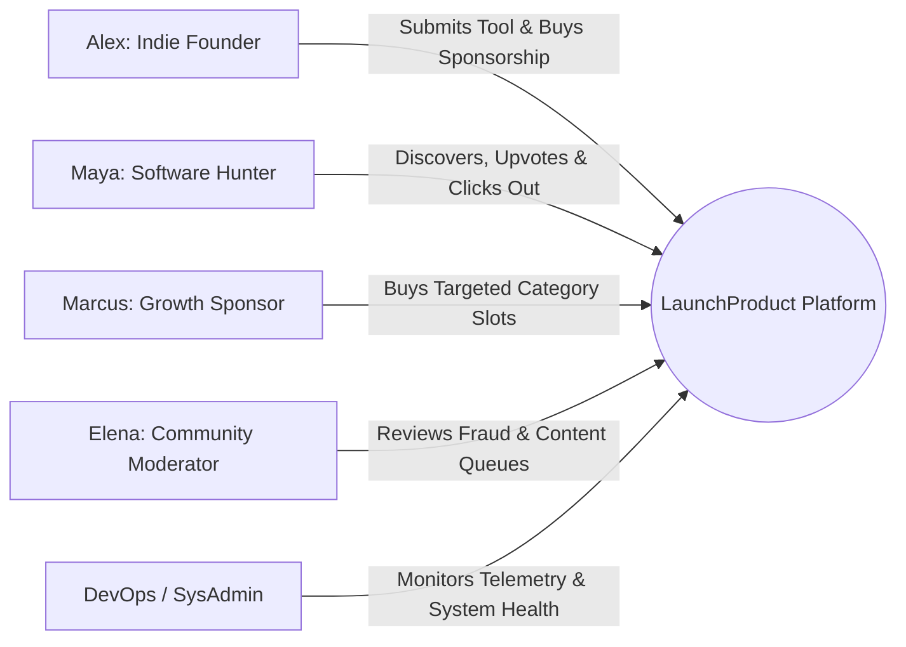

# LaunchProduct — Comprehensive PRD Analysis & Requirements Review

**Author:** Senior Product Analyst & Business Analyst  
**Document Reviewed:** [PRD.md](file:///e:/NAFIZ%20DAIRY/AI%20Developers/SAAS%2002/PRD.md) (Version 1.2.0, Final)  
**Target Environment:** Node.js 20 LTS / Next.js 14+ / MongoDB Atlas / Redis 7 / Docker  
**Status:** Complete Analysis  
**Date:** September 18, 2026  

---

## 1. Executive Product Overview

### 1.1 Product Summary
**LaunchProduct** is a specialized product discovery, community launch, and growth marketplace designed specifically for builders of SaaS applications, autonomous AI agents, developer utilities, and digital micro-products. 

It implements a **Dual-Engine Architecture**:
1. **Organic Discovery Engine**: Ranks products purely on community engagement (authenticated upvotes, qualified organic outbound clicks, community reviews, and founder velocity), protected by a multi-signal anti-fraud pipeline.
2. **Sponsored Distribution Engine**: Provides transparent, paid promotional placements (Launch Day Boosts, Category Showcases, Run-of-Site Featured banners) that guarantee impressions and clicks without altering or corrupting organic leaderboard ranks.

### 1.2 Problem Statement
The software launch and directory ecosystem currently suffers from two symmetric failure modes:

| Stakeholder | Current Core Pain Points | Industry Failure Mode |
| :--- | :--- | :--- |
| **Early-Stage Founders** | • Extreme difficulty securing initial 100 active users without established social reach or PR budget.<br>• Traditional platforms are dominated by coordinated voting syndicates and agency-run launches.<br>• Pay-to-win directories demand exorbitant bids for ephemeral, low-quality traffic without verifiable click attribution. | **Distribution Deficit & Paywall Fatigue** |
| **Software Hunters & Buyers** | • Directory rankings reflect ad spend and bidding auctions rather than software quality.<br>• Susceptibility to vote manipulation, fake engagement, and spam software.<br>• Lack of transparent distinction between genuine community recommendations and sponsored placements. | **Trust Deficit & Quality Degradation** |

### 1.3 Proposed Solution
LaunchProduct solves this dilemma by introducing a **democratized, high-integrity discovery platform** founded upon three immutable pillars:
1. **Structural Traffic-Source Isolation**: Paid advertising clicks and organic community engagement are processed through isolated telemetry paths. Sponsored spend **can never** alter organic leaderboard positions ($U_{\text{organic\_clicks}}$ only).
2. **Multi-Signal Risk-Weighted Anti-Fraud Engine**: Eliminates simple IP/cookie manipulation through 6-factor risk scoring (account maturity, subnet concentration, burst velocity, ASN reputation, disposable email filtering, and browser behavior).
3. **Immutable Daily Leaderboard Snapshots**: Daily leaderboards freeze definitively at `23:59:59 UTC`, generating tamper-proof historical snapshots that power verifiable badge embeds and establish permanent social proof for winning founders.

---

## 2. User Personas & Stakeholder Analysis

The PRD defines five primary user classes. Each persona interacts with specific platform boundaries and requires distinct functional capabilities:



### 2.1 Persona 1: Alex — The Indie Founder / Solopreneur
- **Profile:** Technical solo founder or small team building micro-SaaS or AI tools. Limited marketing budget ($0–$150) and zero existing audience.
- **Primary Goals:**
  - Launch tool quickly without writing complex marketing copy (leveraging the AI auto-fill scraper).
  - Gain immediate, verifiable referral traffic and early user feedback.
  - Earn permanent social proof (badges like "Top 3 Product of the Day").
- **Key Pain Points:** Disheartened by legacy launch platforms where top spots are captured by VC-funded startups with coordinated launch campaigns.
- **Platform Surface:** Submit Product Form, Ownership Claim Flow, Founder Dashboard (Click/CTR Analytics), Badge Embed Generator, Sponsorship Checkout.

### 2.2 Persona 2: Maya — The Early Adopter / Software Hunter
- **Profile:** Software engineer, product manager, tech enthusiast, or agency operator hunting for innovative tools to improve workflow.
- **Primary Goals:**
  - Discover genuinely useful, freshly launched software before it goes mainstream.
  - Upvote high-quality tools and contribute feedback without being spammed.
  - Rely on honest, unmanipulated rankings.
- **Key Pain Points:** Frustrated by directories where the first 5 results are paid sponsors disguised as organic top products.
- **Platform Surface:** Homepage Leaderboard, Category Pages, Product Detail Pages (PDP), Magic-Link Login, Upvote Action.

### 2.3 Persona 3: Marcus — The Growth Sponsor / Micro-Fund Operator
- **Profile:** Bootstrapped founder with modest revenue ($1k–$10k MRR) or growth marketer looking to accelerate user acquisition.
- **Primary Goals:**
  - Purchase high-intent, targeted exposure across specific software categories.
  - Transparently track verified outbound clicks, impressions, and CTR.
  - Simple, compliant checkout without managing complex ad bids or subscription locks.
- **Key Pain Points:** Low return on investment (ROI) on ad networks; lack of transparent analytics.
- **Platform Surface:** Category Sponsorship Grid, Checkout Modal (Merchant of Record), Campaign Management Dashboard.

### 2.4 Persona 4: Elena — The Community Curator / Moderator
- **Profile:** Internal team member or trusted community curator responsible for directory quality and trust.
- **Primary Goals:**
  - Review submitted products for minimum quality, category fit, and functional websites.
  - Investigate flagged votes, suspicious velocity bursts, and bot syndicates.
  - Resolve ownership verification disputes.
- **Key Pain Points:** Manual data inspection; dealing with sophisticated rotating proxy botnets.
- **Platform Surface:** Admin Moderation Desk, Pending Approval Queue, Anti-Fraud Quarantine Desk, Ownership Dispute Desk.

### 2.5 Persona 5: System Administrator / DevOps Lead
- **Profile:** Lead engineer responsible for uptime, security, scraper sandboxing, and MongoDB Atlas persistence.
- **Primary Goals:**
  - Prevent SSRF and cloud metadata theft from malicious user URLs.
  - Maintain sub-150ms directory query performance.
  - Ensure 100% webhook idempotency and campaign inventory integrity.
- **Platform Surface:** Atlas Monitoring, Prometheus Metrics (`/api/metrics`), Pino JSON logs, BullMQ Dashboard.

---

## 3. Product Goals & Success Metrics

### 3.1 Strategic Business Goals
1. **Establish Highest-Integrity Launch Brand**: Become the most trusted discovery destination for AI and SaaS tools by strictly separating paid sponsorship from organic rank.
2. **Achieve Self-Sustaining Supply Flywheel**: Drive founder submissions through frictionless AI scraping and high-value SEO/badge incentives.
3. **Validate Commercial Viability at MVP**: Prove that first-party sponsorship tiers convert at $\ge 2.0\%$ (target: $4.5\%$) to generate sustainable operating cash flow.

### 3.2 North Star Metric
* **Weekly Active Qualified Products (WAQP)**: The number of distinct approved products that receive $\ge 5$ verified organic votes or $\ge 10$ qualified organic outbound clicks in a trailing 7-day window.

### 3.3 Key Performance Indicators (KPIs)

| Dimension | Metric | Baseline (MVP) | Target (Month 3) | Measurement Method |
| :--- | :--- | :---: | :---: | :--- |
| **Supply** | Cumulative Live Products | 100 curated seeds | 500 active tools | `db.products.countDocuments({ status: 'LIVE' })` |
| **Supply Velocity** | Weekly Product Submissions | 15 / week | 50 / week | Weekly submission logs |
| **Audience** | Monthly Unique Discovery Visitors | 2,500 / month | 25,000 / month | First-party salted HMAC session tracking |
| **Engagement** | Outbound Click-Through Rate (CTR)| $\ge 5.0\%$ | $\ge 8.5\%$ | $\frac{\text{Unique Outbound Clicks}}{\text{Unique PDP Pageviews}}$ |
| **Integrity** | Suspicious Vote Quarantine Rate | Monitored | 2.0% – 8.0% | $\frac{\text{Quarantined Votes}}{\text{Total Votes}}$ |
| **Integrity** | False-Positive Appeal Overturn Rate| $< 5.0\%$ | $< 2.0\%$ | $\frac{\text{Overturned Quarantines}}{\text{Total Quarantined Votes}}$ |
| **Monetization** | Submit-to-Promote Conversion Rate| $2.0\%$ | $4.5\%$ | $\frac{\text{Paid Campaigns Created}}{\text{Approved Product Submissions}}$ |
| **Technical** | Directory Search & Filter Latency | $\le 150$ms (p95) | $\le 100$ms (p95) | Atlas Query Profiler / Prometheus |

---

## 4. Functional Requirements Decomposition

The functional requirements defined in PRD v1.2.0 are grouped into 8 cohesive architectural modules:

### 4.1 Authentication & User Management (FR-AUTH)
- **FR-AUTH-01: Passwordless Authentication**: Users authenticate via magic link (email) or OAuth 2.0 (Google, GitHub). Magic-link tokens are 32-byte secure random strings, stored hashed (SHA-256) in MongoDB with a 15-minute TTL.
- **FR-AUTH-02: Role-Based Access Control (RBAC)**: Supports roles: `HUNTER` (default authenticated), `FOUNDER` (verified tool owner), `MODERATOR` (review queue access), and `ADMIN` (system configuration and financial access).
- **FR-AUTH-03: Founder Profile**: Embedded 1:1 subdocument in `users` collection containing `bio`, `twitterHandle`, and `linkedinUrl`.

### 4.2 Product Directory & Catalog (FR-DIR)
- **FR-DIR-01: Category Hierarchy**: Exactly 8 top-level categories for MVP (`ai-tools`, `saas`, `developer-tools`, `productivity`, `marketing-sales`, `design-tools`, `analytics-data`, `utilities`).
- **FR-DIR-02: MongoDB Atlas Search & Filtering**: Sub-150ms compound text search across `name` (weight 10), `tagline` (weight 5), and `description` (weight 1), combined with category, pricing type, and sort filters with cursor pagination.
- **FR-DIR-03: Product Submission Workflow**: Founders enter a website URL; the isolated scraper auto-extracts OpenGraph metadata and clean semantic text; an LLM generates structured name, tagline, description, category, and bullet points. Founder reviews and confirms before entering moderation queue.
- **FR-DIR-04: Canonical Domain Uniqueness**: System rejects duplicate product submissions with identical apex domains.
- **FR-DIR-05: Product Revision History**: Substantial metadata edits post-launch require moderation review and are recorded in `product_revisions`.

### 4.3 Voting & Community Engagement (FR-VOTE)
- **FR-VOTE-01: Single Vote Invariant**: Authenticated users may vote exactly once per product across its entire lifecycle (enforced by compound unique index `{ productId: 1, userId: 1 }`).
- **FR-VOTE-02: Founder Self-Vote**: Product creators may cast their single permitted account vote for their own product.
- **FR-VOTE-03: Edge Rate Limiting**: Upvote submissions are rate-limited to 10 requests/minute per user and 60 requests/minute per subnet.

### 4.4 Multi-Signal Anti-Fraud & Risk Engine (FR-FRAUD)
- **FR-FRAUD-01: Synchronous vs. Asynchronous Pipeline**: Fast edge checks (rate limits, disposable emails, self-voting invariants) execute synchronously; detailed risk factor evaluations and event logging execute asynchronously.
- **FR-FRAUD-02: Multi-Factor Risk Scoring**: Calculates risk score ($0–100$) using weighted signals:
  - Account Age ($w=20$)
  - Disposable Email ($w=25$)
  - ASN Reputation ($w=20$)
  - Subnet Concentration ($w=15$)
  - Burst Velocity ($w=10$)
  - Browser Interaction Telemetry ($w=10$)
- **FR-FRAUD-03: Four Distinct Fraud States**:
  - `VALID` ($\text{Score} < 30$): Increments live score counter.
  - `FLAGGED_FOR_REVIEW` ($30 \le \text{Score} < 70$): Increments score counter, flagged for administrative review.
  - `QUARANTINED` ($\text{Score} \ge 70$): Does **not** increment score counter; routed to admin quarantine desk.
  - `REJECTED_BOT`: High-confidence automated attack; returns silent HTTP 200 with 0 score contribution.

### 4.5 Ranking Engine (FR-RANK)
- **FR-RANK-01: Four Independent Ranking Engines**:
  1. *Launch Day Score* ($S_{\text{launch}} = w_v \cdot V_{\text{weighted}} + w_c \cdot \log_{10}(1 + U_{\text{organic\_clicks}}) + w_a \cdot A_{\text{founder}}$)
  2. *Trending Score* ($S_{\text{trending}} = \frac{V_{7d} + 0.5 \cdot C_{7d} + 2.0 \cdot R_{7d}}{(T_{\text{age\_days}} + 2)^{1.5}} \cdot Q$)
  3. *All-Time Score* ($S_{\text{all\_time}} = \log_{10}(V_{\text{total}} + 1) \cdot 50 + \text{BayesianReviewScore} + \log_{10}(C_{\text{total}} + 1) \cdot 15$)
  4. *Category Score* ($S_{\text{category}}$ derived from normalized all-time score restricted to specific `categoryId`).
- **FR-RANK-02: Immutable UTC Daily Freeze**: At `23:59:59 UTC`, a scheduled BullMQ worker freezes the daily leaderboard, writing an immutable record into `daily_leaderboard_snapshots`. Historical awards ("#1 Product of the Day") remain permanent and immutable.
- **FR-RANK-03: Structural Click Isolation**: Outbound clicks tagged `SPONSORED` are strictly excluded from $U_{\text{organic\_clicks}}$ and trending scores.

### 4.6 Global Monetization & Merchant of Record (FR-PAY)
- **FR-PAY-01: First-Party Advertising Scope**: LaunchProduct sells its own promotional services only. No marketplace seller payouts, creator split settlements, seller KYC, or escrow.
- **FR-PAY-02: Provider-Agnostic Architecture**: Implements `PaymentProvider` abstraction with generic fields (`provider`, `provider_payment_id`, `provider_customer_id`, `provider_order_id`, `provider_event_id`). Primary direction: Paddle; fallback: Lemon Squeezy.
- **FR-PAY-03: Three Commercial Sponsorship Tiers**:
  - *Tier 1: Launch Day Boost* ($19/day, 3 slots/day)
  - *Tier 2: Category Showcase* ($49/week, 2 slots/category/week)
  - *Tier 3: Run-of-Site Featured* ($149/week, 1 slot/week)
- **FR-PAY-04: Inventory Reservation Locking**: Temporary 15-minute hold on campaign slots in Redis (`SET slot:reserve:... NX EX 900`) and MongoDB (`status: 'RESERVED'`).
- **FR-PAY-05: Server-Side Webhook Idempotency**: Payment confirmation originates strictly from verified provider webhooks. Idempotency enforced via unique compound index `{ provider: 1, providerEventId: 1 }`. Frontend redirect pages **never** activate campaigns.

### 4.7 Privacy-Safe Analytics & Attribution (FR-ANLT)
- **FR-ANLT-01: Zero Third-Party Tracking**: No third-party ad tracking pixels or marketing cookies.
- **FR-ANLT-02: Salted HMAC Session Hashing**: User sessions hashed using daily-rotating server secret: $\text{SessionHash} = \text{HMAC-SHA256}(\text{IP} + \text{UserAgent}, \text{DailySalt})$. Raw IP addresses are **never** stored.
- **FR-ANLT-03: 90-Day Raw Event Purge**: Granular raw events in `activity_events` are automatically purged after 90 days via MongoDB TTL index.
- **FR-ANLT-04: Outbound Click Attribution**: Redirector (`/r/[productId]`) logs event asynchronously and returns immediate HTTP 302 redirect.

### 4.8 Ownership Verification Lifecycle (FR-OWN)
- **FR-OWN-01: Three Verification Methods**:
  - `EMAIL_DOMAIN`: Apex domain of verified user email matches product website apex domain.
  - `DNS_TXT`: Founder creates TXT record `launchproduct-verify=[token]`.
  - `HTML_META`: Founder places `<meta name="launchproduct-site-verification" content="[token]">` on homepage.
- **FR-OWN-02: Five-State Lifecycle**: `PENDING`, `VERIFIED`, `FAILED`, `REVOKED`, `DISPUTED`.
- **FR-OWN-03: 72-Hour TTL**: Unverified claims expire automatically via MongoDB TTL index.
- **FR-OWN-04: Single Verified Owner Invariant**: Enforced via partial unique index `db.ownership_verifications.createIndex({ productId: 1 }, { unique: true, partialFilterExpression: { status: "VERIFIED" } })`.

### 4.9 Moderation & Trust Operations (FR-MOD)
- **FR-MOD-01: Moderation Desk Queues**: Product Approval Queue, Anti-Fraud Quarantine Desk, Review Dispute Queue, Campaign Inventory Grid, System Audit Log.
- **FR-MOD-02: Audit Trail**: Every administrative action is logged immutably in `moderation_actions`.

---

## 5. Non-Functional Requirements (NFRs)

```text
┌────────────────────────────────────────────────────────────────────────┐
│                   Non-Functional Requirements Summary                  │
├───────────────────┬────────────────────────────────────────────────────┤
│ Performance       │ • Directory Search & Filter: p95 <= 150ms          │
│                   │ • Outbound Click Redirect: <= 25ms                 │
│                   │ • Upvote Response: <= 80ms                         │
│                   │ • Core Web Vitals: LCP <= 2.5s, INP <= 100ms       │
├───────────────────┼────────────────────────────────────────────────────┤
│ Security & SSRF   │ • Scraper isolated in zero-internal-VPC container  │
│                   │ • DNS pre-resolution & private IP blacklist        │
│                   │ • Content Security Policy & DOMPurify markdown     │
│                   │ • mongo-sanitize preventing injection operators    │
├───────────────────┼────────────────────────────────────────────────────┤
│ Privacy & GDPR    │ • Salted HMAC session hashes (daily rotating salt) │
│                   │ • Zero raw IP address storage                      │
│                   │ • 90-day automatic raw event TTL pruning           │
│                   │ • User deletion target: <= 72 hours                │
├───────────────────┼────────────────────────────────────────────────────┤
│ Reliability & DB  │ • MongoDB Atlas M10+ (3-node multi-AZ replica set) │
│                   │ • Continuous Cloud Backups + 7-day granular PITR   │
│                   │ • RPO < 1 minute; RTO < 15 minutes                 │
│                   │ • 99.9% uptime target (< 43.8 min monthly downtime)│
└───────────────────┴────────────────────────────────────────────────────┘
```

---

## 6. Gap Analysis & Incomplete Requirements

While PRD v1.2.0 is thoroughly hardened, a rigorous business analyst audit reveals several edge cases, implicit behaviors, and underspecified operational requirements that must be formalized before or during sprint implementation:

### 6.1 Edge Case: Campaign Rescheduling vs. Product Launch Date Coupling
* **Observation in PRD**: A founder can book a "Launch Day Boost" ($19/day) tied to a specific calendar date. A product also has a `launchDate` field.
* **The Gap**: What occurs if a founder books a Launch Day Boost for September 25th, but their product submission review is delayed, or the founder manually postpones their launch date to October 1st?
* **Impact**: Potential financial dispute or wasted ad spend if the paid slot fires while the product is still in `PENDING_REVIEW` or `SCHEDULED`.
* **Analyst Recommendation**: Enforce a business validation rule: A Launch Day Boost can only be purchased for a product whose `status` is already `APPROVED` or `SCHEDULED`, and the slot date must strictly lock the product's `launchDate`. If the founder requests a date change, the campaign must be automatically rescheduled via admin intervention or cancelled if the target date has no available inventory.

### 6.2 Edge Case: Product Category Reclassification Post-Launch
* **Observation in PRD**: Products belong to a single `categoryId` with an immutable category hierarchy for MVP. Founders or moderators can edit product metadata via revisions.
* **The Gap**: If a product launched under `ai-tools` is later reassigned by a moderator to `utilities`, how does this impact historical category rankings and trending scores?
* **Impact**: Potential ranking score distortion or orphan entries in historical category leaderboards.
* **Analyst Recommendation**: Explicitly state that historical frozen snapshots (`daily_leaderboard_snapshots`) **never** change retroactively. The category reassignment applies strictly to current and future query windows.

### 6.3 Edge Case: User Deletion (GDPR) vs. Immutable Snapshot & Vote Integrity
* **Observation in PRD**: Users can request account erasure under GDPR (target: $\le 72$ hours). Meanwhile, historical daily leaderboards must remain permanently immutable, and single-vote invariants must prevent vote re-casting.
* **The Gap**: When a user account document is anonymized or deleted, what happens to their historical vote documents in the `votes` collection?
* **Impact**: If vote documents are hard-deleted, re-aggregating historical scores would yield inconsistent results compared to the frozen daily snapshot. If votes are deleted, the user could re-register with the same email and re-vote.
* **Analyst Recommendation**: Implement **Cryptographic Anonymization** rather than hard deletion. When a user requests deletion:
  1. Anonymize the `users` document (clear email, profile, IP logs; replace with pseudonymous identifier `deleted_user_[id]`).
  2. Retain the `votes` documents with `userId` intact to preserve unique index constraints and historical audit trails, but strip all personal identifiers.
  3. Reaffirm that frozen daily snapshots are static historical artifacts that are never recalculated.

### 6.4 Missing Requirement: Scraper Fallback & Manual Metadata Entry
* **Observation in PRD**: Product submission begins with the automated scraper fetching OpenGraph tags and generating AI metadata (Section 7.1, FR-DIR-03).
* **The Gap**: What happens if the founder's website is protected by Cloudflare Bot Management, CAPTCHA, geo-blocking, or returns HTTP 403 to the sandboxed scraper?
* **Impact**: The founder is completely blocked from completing the product submission flow.
* **Analyst Recommendation**: Introduce a mandatory fallback: If the automated scrape job fails after 2 retries (or times out after 10s), the UI must smoothly transition to a **"Manual Entry" mode**, allowing the founder to input name, tagline, description, and upload their own logo/OG image directly.

### 6.5 Ambiguity: Review Engine Phasing vs. Ranking Formulas
* **Observation in PRD**: PRD Section 5.2 explicitly places "Community Reviews & Ratings" into **Phase 2 (Post-MVP)**. However, Section 8.1 defines trending and all-time ranking formulas containing review terms ($2.0 \cdot R_{7d}$ and Bayesian review score with $K=5$).
* **The Gap**: Developers might mistakenly spend time implementing review collections and UI in MVP, or the ranking calculation could crash due to null review collections.
* **Analyst Recommendation**: PRD Change Log v1.2.0 already notes that formulas gracefully evaluate with $R_d = 0$ and $N_{\text{reviews}} = 0$. Ensure the database schema explicitly marks the `reviews` collection as optional/stubbed for MVP, and ensure ranking workers default review terms to zero without failing.

---

## 7. Risk Management & Open Governance Items

The following governance items extracted from PRD Section 17 require ongoing tracking and executive resolution:

```text
┌────────────────────────────────────────────────────────────────────────┐
│                     Open Decisions & Validation Tracker                │
├─────────────────────────┬──────────────────────────────────────────────┤
│ Open Product Decisions  │ • Daily leaderboard clock: 00:00:00 UTC vs   │
│                         │   rolling 24-hour window (Rec: 00:00:00 UTC) │
│                         │ • Free submissions: Instant vs Scheduled     │
│                         │   (Rec: Scheduled calendar queue)            │
├─────────────────────────┼──────────────────────────────────────────────┤
│ Legal Review Required   │ • Non-refundable digital ad Terms of Service │
│                         │ • Visual ad disclosure guidelines compliance │
│                         │ • Privacy policy on salted IP hashing        │
├─────────────────────────┼──────────────────────────────────────────────┤
│ Real-World Validation   │ • MoR (Paddle/Lemon Squeezy) business account│
│                         │   approval & payout rails for operating unit │
│                         │ • $19 Launch Boost price conversion rate     │
│                         │ • Calibration of anti-fraud signal weights   │
├─────────────────────────┼──────────────────────────────────────────────┤
│ Engineering Validation  │ • MongoDB Atlas compound text search latency │
│                         │   (target: <= 150ms p95 under load)          │
│                         │ • Redis queue spike throughput (500 req/s)   │
└─────────────────────────┴──────────────────────────────────────────────┘
```

---

## 8. Business Analyst Recommendations & Implementation Next Steps

Based on this comprehensive analysis, the product requirements are **commercially sound, architecturally hardened, and implementation-ready**. 

### Recommended Next Steps (in accordance with master roadmap):
1. **Proceed to [ERD.md](file:///e:/NAFIZ%20DAIRY/AI%20Developers/SAAS%2002/ERD.md)**: Formalize the complete MongoDB Atlas document schema, Mongoose models, validation rules, and index definitions, incorporating the GDPR anonymization and manual submission fallback schemas.
2. **Proceed to [API Specification.md](file:///e:/NAFIZ%20DAIRY/AI%20Developers/SAAS%2002/API%20Specification.md)**: Define all REST endpoints, request/response contracts, Zod schemas, error objects, and webhook signatures.
3. **Execute Sprint 0**: Initialize Next.js 14+ standalone repo, MongoDB Atlas M10+ cluster, Redis 7 instance, and Docker Compose development environment.
