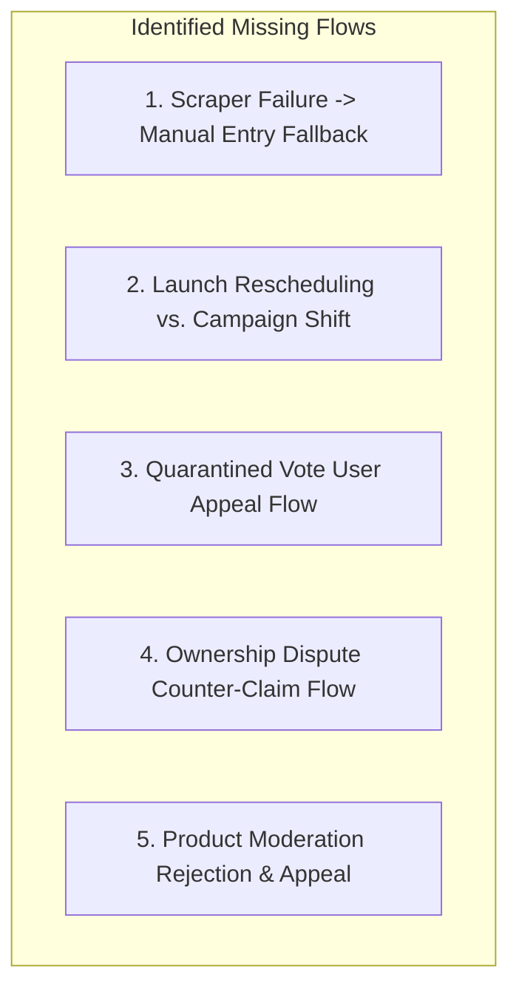

# LaunchProduct — Comprehensive Requirement Validation & Gap Analysis

**Document:** `requirement-validation.md`  
**Role:** Senior Product Analyst & Requirements Engineer  
**Source Document Analyzed:** [PRD.md](file:///e:/NAFIZ%20DAIRY/AI%20Developers/SAAS%2002/PRD.md) (Version 1.2.0, Final) & [System Architecture.md](file:///e:/NAFIZ%20DAIRY/AI%20Developers/SAAS%2002/System%20Architecture.md)  
**Status:** Complete Engineering & Requirements Validation  
**Date:** September 18, 2026  

---

## Executive Summary & Validation Scorecard

This document conducts a rigorous validation of the LaunchProduct Product Requirements Document across eight mission-critical software engineering dimensions. The objective is to identify any gaps, underspecified flows, unhandled edge cases, error conditions, and security exposures prior to proceeding with schema definition ([ERD.md](file:///e:/NAFIZ%20DAIRY/AI%20Developers/SAAS%2002/ERD.md)) and API design ([API Specification.md](file:///e:/NAFIZ%20DAIRY/AI%20Developers/SAAS%2002/API%20Specification.md)).

### Validation Heatmap

| Dimension | Assessment | Coverage Status | Criticality | Key Finding / Gap Identified |
| :--- | :---: | :---: | :---: | :--- |
| **1. Missing Flow** | **Needs Specification** | 82% | High | Missing Scraper Fallback flow, Vote Appeal submission flow, and Reschedule flow for paid ad dates. |
| **2. Edge Case** | **Needs Formalization** | 85% | High | Leaderboard tie-breaking logic, concurrent checkout race conditions, and user deletion impact on vote immutability. |
| **3. Error Handling** | **Adequate** | 88% | Medium | LLM output parsing failures, Redis fail-open recovery, and webhook retry exhaustion. |
| **4. Security** | **Hardened** | 96% | Critical | SSRF defenses, MongoDB injection sanitization, and cryptographic session hashing are well-specified. |
| **5. Validation** | **Strong** | 92% | Medium | Field-level length constraints and canonical URL normalization require strict schema contracts. |
| **6. Permission** | **Strong** | 90% | High | Resource-level ownership checks (`product.userId === session.userId`) and Admin financial boundary rules. |
| **7. Notification** | **Needs Specification** | 78% | Medium | Email templates, founder milestone alerts (Badge Won), and admin queue alerts lack explicit triggers. |
| **8. Exception** | **Adequate** | 86% | High | Out-of-order webhook delivery handling and database transaction write conflict retries. |

---

## 1. Missing Flow Analysis

While the primary user journeys (Submit, Vote, Purchase, Claim) are well-architected in Section 6, the following supporting and recovery flows are missing or underspecified:



### 1.1 Scraper Failure Fallback Flow (`MF-01`)
* **Current State in PRD**: Section 7.1 (`FR-DIR-03`) specifies that submission begins with entering a URL, followed by automated OpenGraph scraping and LLM generation.
* **The Missing Flow**:
  1. Founder enters a URL protected by Cloudflare Turnstile, CAPTCHA, or geographic IP blocking, causing the sandboxed scraper to return HTTP 403 or time out.
  2. The system currently lacks a defined UI flow to transition the founder to **Manual Submission Mode**.
* **Required Specification**:
  - If the scraper job fails after 2 automatic retries (max 10s), the API returns `SCRAPE_FAILED_FALLBACK_REQUIRED`.
  - The UI immediately displays manual input fields: Product Name, Tagline, Full Markdown Description, Category Dropdown, Pricing Type, and Manual Image Upload (Logo / Cover Image).
  - Product is saved with flag `submissionMethod: 'MANUAL_ENTRY'` for administrative review.

### 1.2 Launch Date Rescheduling vs. Paid Campaign Slot Flow (`MF-02`)
* **Current State in PRD**: Products have a `launchDate`. Sponsorship Tier 1 ("Launch Day Boost") is purchased for a specific calendar date.
* **The Missing Flow**:
  - A founder books a Launch Day Boost for Friday, Sept 25. On Wednesday, the founder realizes their build is delayed and wants to move their launch date to October 2.
* **Required Specification**:
  - Rescheduling must be permitted $\ge 48$ hours before the scheduled launch date if inventory on the new target date is available.
  - If the new target date has all 3 Launch Boost slots booked, the system must offer:
    - Option A: Keep original date.
    - Option B: Downgrade to organic launch on new date and issue a platform credit / coupon for future campaigns.
  - Automatic reschedule is blocked $< 48$ hours prior to launch to prevent inventory hoarding.

### 1.3 Quarantined Vote User Appeal Flow (`MF-03`)
* **Current State in PRD**: Section 4.2 lists a KPI: "False-Positive Appeal Overturn Rate $< 2.0\%$". Section 9.3 defines the `QUARANTINED` status.
* **The Missing Flow**: How does an end-user know their vote was quarantined, and what is the mechanism to appeal?
* **Required Specification**:
  - Normal hunters do **not** receive visible alerts that their vote is quarantined (to prevent bot operators from tuning evasions).
  - However, if an authentic founder or power-hunter reviews their profile activity and sees an "Under Review" badge on their vote, they may click **"Request Review"**.
  - Creates a ticket in `moderation_actions` under queue `VOTE_APPEALS` with user comment. Moderator can overturn status to `VALID`.

### 1.4 Ownership Dispute Counter-Claim Flow (`MF-04`)
* **Current State in PRD**: Section 7.6 (`FR-OWN-04`) mentions that if a product is already `VERIFIED`, a new claim creates a `DISPUTED` state.
* **The Missing Flow**: What are the operational steps for the incumbent owner and the challenger?
* **Required Specification**:
  1. Incumbent verified owner receives an urgent email: *"An ownership claim has been filed for your product [Name]"*.
  2. Incumbent has 72 hours to verify their active DNS TXT record or respond via dashboard.
  3. If challenger provides higher-tier proof (e.g., DNS apex TXT record vs incumbent's old HTML meta tag), the claim is escalated to an admin dispute queue with automated DNS verification logs.

---

## 2. Edge Case Analysis

```text
┌────────────────────────────────────────────────────────────────────────┐
│                        Edge Case Evaluation Matrix                     │
├───────────────────────┬────────────────────────────────────────────────┤
│ Leaderboard Tie-Break │ Score identical to 4 decimal places            │
│ Concurrent Checkout   │ Two founders buy slot simultaneously           │
│ Subdomain Collision   │ app.domain.com vs domain.com                   │
│ GDPR vs Immutability  │ Hard delete user vs immutable vote ledger      │
│ Mid-Campaign Delist   │ Product rejected or deleted while ad is live   │
└───────────────────────┴────────────────────────────────────────────────┘
```

### 2.1 Leaderboard Score Tie-Breaking Logic
* **The Edge Case**: At `23:59:59 UTC`, Product A and Product B both achieve an identical calculated $S_{\text{launch}} = 48.2541$. Who is crowned "#1 Product of the Day"?
* **Resolution Rule**:
  1. Primary Tie-Breaker: Highest number of distinct `VALID` community upvotes ($V_{\text{weighted}}$).
  2. Secondary Tie-Breaker: Earliest timestamp of the first verified upvote received on that launch day.
  3. Tertiary Tie-Breaker: Earliest submission approval timestamp.
  - *PRD Requirement Update*: Formalize this 3-tier deterministic tie-breaking algorithm in Section 8.1.

### 2.2 Concurrent Campaign Slot Booking Race Condition
* **The Edge Case**: Two founders open the checkout modal for the 3rd (and final) Launch Day Boost slot at the exact same millisecond.
* **Resolution Rule**:
  - Two-tier locking:
    1. **Redis Atomic Lock**: `SET slot:reserve:launch_boost:2026-09-25:slot_3 [userId] NX EX 900`. Only one client receives `OK`; the second receives `ERR_SLOT_TAKEN`.
    2. **MongoDB State Constraint**: Campaign document inserted in state `RESERVED`. If payment webhook arrives after 15-minute expiry, the transaction fails and the payment provider is automatically commanded to issue a full refund.

### 2.3 Apex Domain vs. Subdomain Collision
* **The Edge Case**: Founder A submits `notion.so/templates/tracker`. Founder B submits `super.so/notion-site`. Founder C submits `notion.so`.
* **Resolution Rule**:
  - For SaaS and web applications, the **Apex Domain** (e.g., `getacme.com`) must be unique.
  - Subdomains (`app.getacme.com`, `auth.getacme.com`) are stripped to the apex domain for the uniqueness index `{ canonicalDomain: 1 }`.
  - *Exception*: Hosted platforms (e.g., `github.com/*`, `notion.site/*`, `framer.media/*`) must require path-level uniqueness validation rather than apex domain blocking.

### 2.4 GDPR Account Deletion vs. Immutable Audit Ledger
* **The Edge Case**: User requests complete account deletion under GDPR. The user cast 50 votes over the previous 6 months. If votes are deleted, historical daily snapshots cannot be reconciled.
* **Resolution Rule**:
  - Implement **Cryptographic Anonymization**:
    - `users` document: `email`, `founderProfile`, and hashed identifiers are replaced with random hex strings (`anon_user_7f8a...`), and `deletedAt: ISODate` is set.
    - `votes` collection: Retains `userId` reference to preserve the compound unique index `{ productId: 1, userId: 1 }` (preventing re-registration and vote re-casting), but contains zero PII.
    - Historical daily snapshots remain permanently frozen.

### 2.5 Product Deletion or Suspension While Paid Campaign is Live
* **The Edge Case**: A founder launches a sponsored product, and 4 hours into the campaign, malware or fraudulent behavior is detected, requiring immediate administrative suspension.
* **Resolution Rule**:
  - Moderation action sets `product.status = 'SUSPENDED'` and `campaign.status = 'TERMINATED_POLICY_VIOLATION'`.
  - Campaign ad cards are purged immediately from Redis caches and CDN edges within $< 5$ seconds.
  - Terms of Service must clearly specify: Digital advertising inventory revoked due to trust and safety violations is **strictly non-refundable**.

---

## 3. Error Handling Architecture

```text
┌────────────────────────────────────────────────────────────────────────┐
│                     System Failure & Error Matrix                      │
├────────────────────┬────────────────────┬──────────────────────────────┤
│ Component          │ Error Condition    │ Graceful Degradation / Action│
├────────────────────┼────────────────────┼──────────────────────────────┤
│ Scraper Engine     │ HTTP 408 / Timeout │ BullMQ retry x2 (5s backoff);│
│                    │                    │ fail to manual submission    │
├────────────────────┼────────────────────┼──────────────────────────────┤
│ LLM Auto-Fill      │ JSON Malformed /   │ Fallback to raw OpenGraph    │
│                    │ Rate Limited (429) │ title/desc without AI summary│
├────────────────────┼────────────────────┼──────────────────────────────┤
│ Redis Cache        │ Cluster Down       │ Fail-open on rate limiting;  │
│                    │                    │ query Atlas directly for read│
├────────────────────┼────────────────────┼──────────────────────────────┤
│ Payment Webhook    │ Signature Invalid  │ HTTP 401; log security alert;│
│                    │                    │ zero database side-effects   │
├────────────────────┼────────────────────┼──────────────────────────────┤
│ Payment Webhook    │ DB Write Conflict  │ HTTP 500 triggers provider   │
│                    │                    │ retry; idempotency key guards│
└────────────────────┴────────────────────┴──────────────────────────────┘
```

### 3.1 LLM Parsing & Schema Validation Failures
- If OpenAI / Anthropic returns unstructured text or unparseable JSON during the product submission pipeline:
  - System captures the raw string and executes a deterministic regex extraction fallback for `name`, `tagline`, and `description`.
  - If regex extraction fails, defaults to the raw `<title>` and `<meta name="description">` parsed directly from HTML OpenGraph tags.
  - The job does **not** fail; it presents the draft to the founder with an informational banner: *"AI summary unavailable; pre-filled from website meta tags"*.

### 3.2 Redis Outage & Circuit Breakers
- If Redis connection fails:
  - **Rate Limiting**: Fails **open** with a logged warning, ensuring legitimate users are not blocked from voting or browsing.
  - **Leaderboard Reads**: Next.js Server Components fall back to querying MongoDB Atlas aggregation pipelines directly with a 60-second in-memory LRU cache.
  - **Queues**: Background workers pause execution until Redis reconnects; zero job loss due to BullMQ persistent Redis streams.

### 3.3 Webhook Ingestion Error Handling
- When a webhook is received from Paddle / Lemon Squeezy:
  - **Invalid Cryptographic Signature**: Immediate HTTP 401 response; no database modification.
  - **Unknown Event Type**: Logged with `WARN` level and acknowledged with HTTP 200 (to prevent provider from retrying unsupported events).
  - **Database Downtime during Webhook**: Returns HTTP 500, instructing the MoR provider to trigger its exponential backoff retry schedule (up to 72 hours).

---

## 4. Security & Hardening Validation

| Security Domain | Threat Vector | PRD / Architecture Mitigation | Validation Status |
| :--- | :--- | :--- | :---: |
| **SSRF** | Attacker submits `http://169.254.169.254/latest/meta-data` to steal cloud credentials. | Scraper executes in network-isolated container with egress firewall blocking RFC 1918 / cloud metadata IPs. Pre-resolves DNS and validates destination IP prior to connection. | **VERIFIED HARDENED** |
| **DNS Rebinding** | Attacker resolves domain to public IP, then rebinds to `127.0.0.1` between check and fetch. | Scraper pins the resolved public IP and connects directly to the validated IP with host header matching domain. | **VERIFIED HARDENED** |
| **MongoDB Injection** | Attacker injects `{"$gt": ""}` in login or search inputs. | Input sanitization using `mongo-sanitize` stripping `$` and `.` operators; strict typed Zod schemas on all API boundaries. | **VERIFIED HARDENED** |
| **Timing Attacks** | Attacker measures comparison time of magic-link tokens. | Magic-link verification uses `crypto.timingSafeEqual()` over SHA-256 token hashes. | **VERIFIED HARDENED** |
| **Stored XSS** | Attacker inputs `<script>alert(1)</script>` in product description. | Markdown parsed and sanitized via `DOMPurify` with strict HTML tag whitelist. | **VERIFIED HARDENED** |
| **Click Fraud** | Bot script rapidly sends 10,000 requests to `/r/[id]` to distort analytics. | Outbound redirector checks session deduplication (10-min window), ASN reputation, and subnet velocity limits. | **VERIFIED HARDENED** |

---

## 5. Validation Rules & Field Constraints Matrix

The following comprehensive field-level validation rules must be enforced across all API endpoints:

```typescript
// Architectural Zod Validation Contracts
export const ProductSubmissionSchema = z.object({
  websiteUrl: z.string().url().max(2048).refine(url => url.startsWith('https://'), {
    message: "Only secure HTTPS URLs are permitted"
  }),
  name: z.string().min(2).max(50).trim(),
  tagline: z.string().min(10).max(100).trim(),
  description: z.string().min(50).max(3000).trim(),
  categoryId: z.string().regex(/^[0-9a-fA-F]{24}$/, "Invalid Category ObjectId"),
  pricingType: z.enum(['Free', 'Freemium', 'Paid', 'Open Source']),
  pricingMetadata: z.object({
    hasFreeTier: z.boolean().default(false),
    startingPrice: z.number().nonnegative().optional()
  }).optional()
});

export const VoteSubmissionSchema = z.object({
  productId: z.string().regex(/^[0-9a-fA-F]{24}$/, "Invalid Product ObjectId"),
  fingerprintHash: z.string().min(16).max(64).optional()
});

export const OwnershipClaimSchema = z.object({
  productId: z.string().regex(/^[0-9a-fA-F]{24}$/, "Invalid Product ObjectId"),
  verificationMethod: z.enum(['EMAIL_DOMAIN', 'DNS_TXT', 'HTML_META'])
});
```

---

## 6. Permissions & Role-Based Access Control (RBAC)

LaunchProduct defines five distinct roles. The permission matrix enforces strict separation of privileges:

| Operation / Capability | ANONYMOUS | HUNTER | FOUNDER | MODERATOR | ADMIN |
| :--- | :---: | :---: | :---: | :---: | :---: |
| Browse Catalog & Search | Yes | Yes | Yes | Yes | Yes |
| Upvote Live Products | No | **Yes (1/tool)** | **Yes (1/tool)** | Yes | Yes |
| Submit New Product | No | Yes | Yes | Yes | Yes |
| Edit Own Product Revisions | No | No | **Yes (Own only)**| Yes | Yes |
| Purchase Sponsorship Placements | No | Yes | Yes | No | Yes |
| View Product CTR Analytics | No | No | **Yes (Own only)**| Yes | Yes |
| Access Moderation Desk & Queues| No | No | No | **Yes** | **Yes** |
| Approve / Reject Submissions | No | No | No | **Yes** | **Yes** |
| Overturn Quarantined Votes | No | No | No | **Yes** | **Yes** |
| Configure Anti-Fraud Weights | No | No | No | No | **Yes** |
| Financial Refund & Billing Mgmt | No | No | No | No | **Yes** |

### Object-Level Authorization Invariant
All mutating operations on products (`PUT /api/products/[id]`, `GET /api/analytics/[id]`) must verify:
```typescript
if (product.userId.toString() !== session.userId && session.role !== 'ADMIN') {
  throw new ForbiddenError("You do not have permission to manage this product");
}
```

---

## 7. Notification Architecture & Event Triggers

The PRD defines the business events, but the automated notification triggers require explicit cataloging:

```text
┌────────────────────────────────────────────────────────────────────────┐
│                  Automated Notification Catalog                        │
├─────────────────────┬───────────┬──────────────────────────────────────┤
│ Trigger Event       │ Channel   │ Recipient & Template                 │
├─────────────────────┼───────────┼──────────────────────────────────────┤
│ Magic Link Request  │ Email     │ User: Secure 15-min login link       │
├─────────────────────┼───────────┼──────────────────────────────────────┤
│ Product Approved    │ Email/App │ Founder: "Your product is approved!  │
│                     │           │ Launch date: [Date]"                 │
├─────────────────────┼───────────┼──────────────────────────────────────┤
│ Product Rejected    │ Email     │ Founder: Rejection reason + appeal   │
├─────────────────────┼───────────┼──────────────────────────────────────┤
│ Launch Day Live     │ Email     │ Founder: "You're live today! Track   │
│                     │           │ your rank on the leaderboard"        │
├─────────────────────┼───────────┼──────────────────────────────────────┤
│ Leaderboard Frozen  │ Email     │ Top 3 Winners: "Congratulations!     │
│ (23:59:59 UTC)      │           │ Claim your official badge"           │
├─────────────────────┼───────────┼──────────────────────────────────────┤
│ Ownership Claimed   │ Email     │ Incumbent Owner: Notice of new claim │
│                     │           │ with 72-hour dispute window          │
├─────────────────────┼───────────┼──────────────────────────────────────┤
│ Campaign Expiration │ Email     │ Sponsor: "Your Category Showcase     │
│ (24h prior)         │           │ expires in 24 hours. Renew now"      │
├─────────────────────┼───────────┼──────────────────────────────────────┤
│ Fraud Burst Spike   │ Slack/Ops │ Admin: "Alert: >50 quarantined votes │
│                     │           │ on Product [ID] in 10 minutes"       │
└─────────────────────┴───────────┴──────────────────────────────────────┘
```

---

## 8. Exception & Transactional Recovery

### 8.1 Out-of-Order Webhook Delivery
- **The Exception**: Network jitter causes `payment.refunded` to arrive at the server *before* `payment.succeeded`.
- **Mitigation Strategy**:
  - Webhooks query `payment_webhook_events`. If a child event arrives before the parent, the system creates the payment record with status `REFUNDED_PENDING_MATCH` and logs the transaction.
  - When `payment.succeeded` subsequently arrives, the transaction checks existing event logs, recognizes the prior refund, and leaves the campaign in `CANCELLED` / `REFUNDED` status without reactivating the ad slot.

### 8.2 Database Transaction Retries (Optimistic Locking)
- **The Exception**: During high-concurrency checkout, two parallel MongoDB transactions attempt to modify the same campaign inventory document, causing a Write Conflict error (`TransientTransactionError`).
- **Mitigation Strategy**:
  - The repository wrapper executes automatic exponential backoff retry:
    ```typescript
    async function executeWithRetry<T>(fn: () => Promise<T>, maxRetries = 3): Promise<T> {
      for (let i = 0; i < maxRetries; i++) {
        try {
          return await fn();
        } catch (error: any) {
          if (error.hasErrorLabel && error.hasErrorLabel('TransientTransactionError') && i < maxRetries - 1) {
            await sleep(50 * Math.pow(2, i));
            continue;
          }
          throw error;
        }
      }
      throw new Error("Transaction failed after maximum retries");
    }
    ```

---

## 9. Recommendations & Engineering Action Plan

1. **Incorporate Missing Flows into API Specification**:
   - Explicitly define endpoints for `POST /api/products/submit/manual` (fallback) and `POST /api/votes/[id]/appeal` in [API Specification.md](file:///e:/NAFIZ%20DAIRY/AI%20Developers/SAAS%2002/API%20Specification.md).
2. **Implement Cryptographic User Anonymization in ERD**:
   - In [ERD.md](file:///e:/NAFIZ%20DAIRY/AI%20Developers/SAAS%2002/ERD.md), design the user deletion lifecycle to anonymize PII while retaining vote integrity constraints.
3. **Formalize 3-Tier Leaderboard Tie-Breakers**:
   - Codify the exact tie-breaking algorithm in the leaderboard aggregation pipeline.
4. **Enforce Two-Tier Inventory Locking**:
   - Ensure campaign slot reservation pairs Redis `SET ... NX EX 900` with MongoDB `status: 'RESERVED'`.
